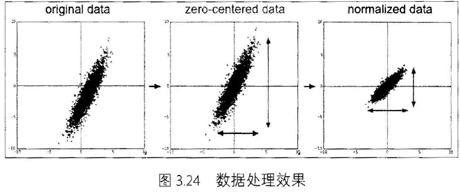
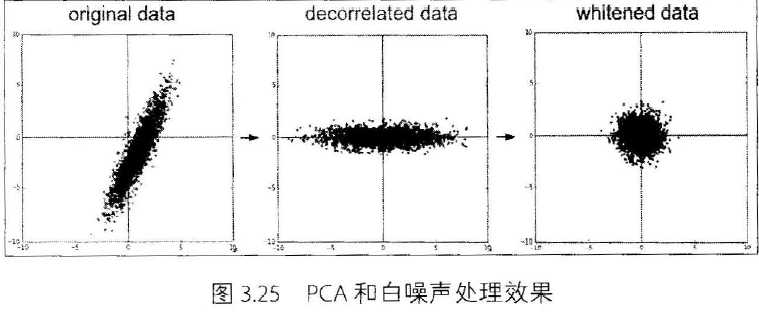

# Pytorch Note22 数据预处理

[toc]

全部笔记的汇总贴：[Pytorch Note 快乐星球](https://blog.csdn.net/weixin_45508265/article/details/117809512)

## 中心化

数据预处理中一个最常见的处理办法就是每个特征维度减去相应的均值实现中心化，这样可以使得数据变成0均值，特别对于一些图像数据，为了方便我们将所有的数据都减去一个相同的值。

## 标准化

使得数据都变成0均值之后，还需要使用标准化的做法让数据不同的特征维度都有着相同的规模。有两种常用的方法：一种是除以标准差，这样可以使得新数据的分布接近标准高斯分布：还有一种常用的做法就是让每个特征维度的最大值和最小值按照比例缩小到-1~1之间。

如果知道输入不同特征有着不同的规模，那就需要使用标准化的方法让他们处于同一个规模下，这对于机器学习而言非常重要。

我们可以通过下列图看看中心化和标准化处理完数据后的结果

## PCA

PCA是一种处理数据的方法，在进行这一步之前，首先要将数据中心化，然后计算数据的协方差矩阵，这一步非常简单。协方差矩阵是半正定的，可以通过这个协方差矩阵来进行奇异值分解（SVD），然后对数据进行去相关性，将其投影到一个特征空间，我们能够取一些较大的，主要特征向量来减低数据的维度，去掉一些没有方差的维度，这也叫做主成分分析（PCA）

这个操作对于一些线性模型和神经网络，都能取到良好的效果。是一种很好的降维方法，极大的减小了我们要处理的数据。

## 白噪声

白噪声也是一种处理数据的方式，首先会跟PCA一样将数据投影到一个特征空间，然后每个维度除以特征值来标准化这些数据，直观上就是一个多元高斯分布转化到了一个0均值，协方差为1的多元高斯分布

具体的PCA和白噪声处理后的图像如图所示

仔细观察上图我们会发现，白噪声的处理会增强数据中的噪声，因为其增强了数据中的所有维度，包括一些方差很小的不相关的维度

## 总结

在实际处理数据中，中心化和标准化都特别重要。我们计算训练集的统计量比如均值，然后将这些统计量应用到测试集和验证集当中。但是PCA和白噪声在卷积中基本不用，因为卷积网络可以自动学习如何提取这些特征而不需要人工干预。

