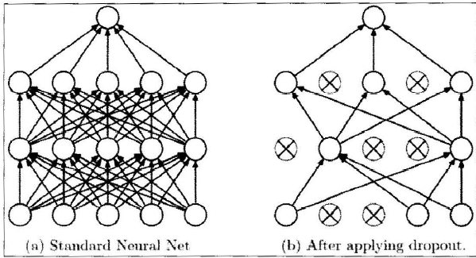
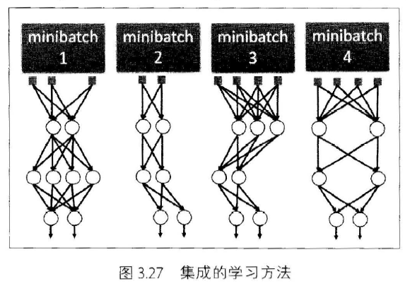

# Pytorch Note24 防止过拟合

[toc]

全部笔记的汇总贴：[Pytorch Note 快乐星球](https://blog.csdn.net/weixin_45508265/article/details/117809512)

在我们的深度学习中，有时候由于我们的网络的容量过大或者数据集过少会造成过拟合，但是防止过拟合的最佳方法不是减少网络容量，下面讲解几个具体的方法来防止我们的过拟合

# 正则化

L2正则化是正则化(rcgularization)中比较常用的形式,它的想法是对于权重过大的部分进行惩罚，也就是直接在损失函数中增加权重的二范数量级，也就是引入w2，其中入是正则化强度，通常使用0.5，因为对于$w^2$的梯度是$2w$，使用就能使得梯度是$\lambda w$而不是$2\lambda w$。所以使用L2正则化可以看成是权重更新在原来的基础上再$-\lambda w$，这样可以让参数更新之后更加靠近0。

L1正则化是另外一种正则化方法，其在损失函数中增加权重的1范数，也就是$\|w\|$，我们也可以把L1正则化和L2正则化结合起来，如$\lambda_1 |w|+\lambda_2 w^2$。L1正则化相对于L2正则化的优势是在优化的过程中可以让权重变得更加稀疏，换句话说，也就是在优化结束的时候，权重只会取一些与最重要的输人有关的权重，这就使得与噪声相关的权重被尽可能降为0。L2正则化的优势在于最终的效果会比L1正则化更加发散，权重也会被限制得更小。

除此之外，还有一种正则化方法叫做最大范数限制，其迫使权重在更新的过程中范数有一个上界，也就是$\|w\| < c$，这种办法可以使得当学习率设置太高的时候网络不会“爆炸"，因为更新总是有界的。

在实际中对于正则化的选择通常使用`L2正则化`，其使用更加常见。

# Dropout

接着我们来介绍一个非常有效、简单、同时也是现在深度学习使用最为广泛的防止过拟合的方——Dropout

其核心想法就是在训练网络的时候依概率P保留每个神经元，也就是说每次训练的时候有些神经元会被设置为0

通过上图我们会发现每次训练都有某些神经元并没有参与到网络中，但是我们在预测的时候不在这样处理。其实也很好理解，如果预测应用Dropout，由于随机性，每次预测出来的结果都不一样，这样预测的时候完全靠运气，这显然是不行的。所以会保留网络全部的权重，取代应用Dropout，在每层网络的输出上应用P的缩放。这个想法是很重要的，因为如果我们不做任何处理，那么网络的行为在预测时和训练时就会不同，这不是所希望的，所以需要应用缩放。

考虑一个神经元在应用Dropout之前的输出是$x$，那么应用Dropout之后它的输出期望值就是$Px+(1-P)0$，所以在预测的时候，如果保留所有的权重，就必须调整$x\rightarrow Px$来保证其输出与期望相同。

还有种理解Dropout的思路就是把Dropout看作是集成的学习方法

每一次训练Dropout之后就可以看作是一个新的模型，然后训练了很多次之后就可以看成是这些模型的集成

在实际应用中，我们大多数会采用全局权重的L2正则化搭配Dropout来防止过拟合

