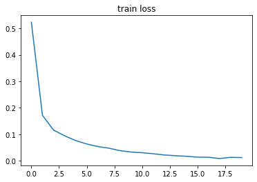
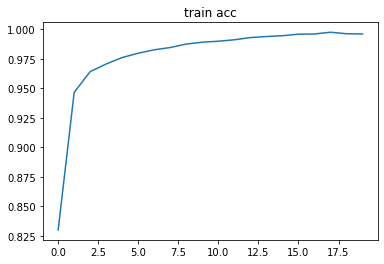
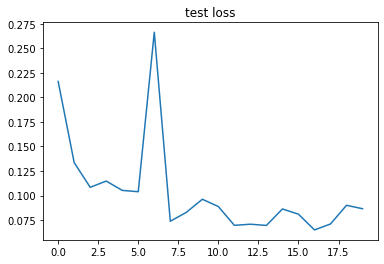
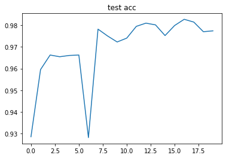

# Pytorch Note25 深层神经网络实现 MNIST 手写数字分类

[toc]

全部笔记的汇总贴：[Pytorch Note 快乐星球](https://blog.csdn.net/weixin_45508265/article/details/117809512)

## MNIST 数据集

mnist 数据集是一个非常出名的数据集，基本上很多网络都将其作为一个测试的标准，其来自美国国家标准与技术研究所, National Institute of Standards and Technology (NIST)。 训练集 (training set) 由来自 250 个不同人手写的数字构成, 其中 50% 是高中学生, 50% 来自人口普查局 (the Census Bureau) 的工作人员，一共有 60000 张图片。 测试集(test set) 也是同样比例的手写数字数据，一共有 10000 张图片。

每张图片大小是 28 x 28 的灰度图，如下


所以我们的任务就是给出一张图片，我们希望区别出其到底属于 0 到 9 这 10 个数字中的哪一个。

## 多分类问题
前面我们讲过二分类问题，现在处理的问题更加复杂，是一个 10 分类问题，统称为多分类问题，对于多分类问题而言，我们的 loss 函数使用一个更加复杂的函数，叫交叉熵。

### softmax
提到交叉熵，我们先讲一下 softmax 函数，前面我们见过了 sigmoid 函数，如下

$$
s(x) = \frac{1}{1 + e^{-x}}
$$
可以将任何一个值转换到 0 ~ 1 之间，当然对于一个二分类问题，这样就足够了，因为对于二分类问题，如果不属于第一类，那么必定属于第二类，所以只需要用一个值来表示其属于其中一类概率，但是对于多分类问题，这样并不行，需要知道其属于每一类的概率，这个时候就需要 softmax 函数了。

softmax 函数示例如下


对于网络的输出 $z_1, z_2, \cdots z_k$，我们首先对他们每个都取指数变成 $e^{z_1}, e^{z_2}, \cdots, e^{z_k}$，那么每一项都除以他们的求和，也就是

$$
z_i \rightarrow \frac{e^{z_i}}{\sum_{j=1}^{k} e^{z_j}}
$$

如果对经过 softmax 函数的所有项求和就等于 1，所以他们每一项都分别表示属于其中某一类的概率。

## 交叉熵
交叉熵衡量两个分布相似性的一种度量方式，前面讲的二分类问题的 loss 函数就是交叉熵的一种特殊情况，交叉熵的一般公式为

$$
cross\_entropy(p, q) = E_{p}[-\log q] = - \frac{1}{m} \sum_{x} p(x) \log q(x)
$$

对于二分类问题我们可以写成

$$
-\frac{1}{m} \sum_{i=1}^m (y^{i} \log sigmoid(x^{i}) + (1 - y^{i}) \log (1 - sigmoid(x^{i}))
$$

这就是我们之前讲的二分类问题的 loss，当时我们并没有解释原因，只是给出了公式，然后解释了其合理性，现在我们给出了公式去证明这样取 loss 函数是合理的

交叉熵是信息理论里面的内容，这里不再具体展开，更多的内容，可以看到下面的[链接](http://blog.csdn.net/rtygbwwwerr/article/details/50778098)

下面我们直接用 mnist 举例，讲一讲深度神经网络

## 多层全连接神经网络实现 MINST 手写数字分类

"Talk is cheap, show me the code"，下面我们用深度学习的入门级数据集 MNIST 手写体分类来说明一下更深层神经网络的优良表现。

### 数据预处理

首先需要进行数据预处理，就像之前介绍的，需要将数据标准化，这里运用到的函数是torchvision.transforms，它提供了很多图片预处理的方法。这里使用两个方法:第一个是`transforms.Torensor()`，第二个是`transforms.Normalize()`

transform. ToTensor()很好理解,就是将图片转换成PyTorch中处理的对象Tensor，在转化的过程中PyTorch自动将图片标准化了，也就是说Tensor的范围是0~1接着我们使用transforms.Normalize(),需要传人两个参数:第一个参数是均值,第二个参数是方差，做的处理就是减均值、再除以方差。

```python
data_tf = transforms.Compose(
	[transforms.ToTensor(),
    transforms.Normalize([0.5,0.5])])
```

这里transforms.Compose()将各种预处理操作组合到一起，transforms.Normalize([0.5]，[0.5])表示减去0.5再除以0.5，这样将图片转化到了-1~1之间，注意因为图片是灰度图，所以只有一个通道，如果是彩色的图片，有三通道，那么用transforms.Normalize([a, b, c]，[d, e，f])来表示每个通道对应的均值和方差。


然后读取数据集

```python
# 使用内置函数下载 mnist 数据集
train_set = mnist.MNIST('./data', train=True, download=True)
test_set = mnist.MNIST('./data', train=False, download=True)

train_set = mnist.MNIST('./data', train=True, transform=data_tf, download=True) # 重新载入数据集，申明定义的数据变换
test_set = mnist.MNIST('./data', train=False, transform=data_tf, download=True)

from torch.utils.data import DataLoader
# 使用 pytorch 自带的 DataLoader 定义一个数据迭代器
train_data = DataLoader(train_set, batch_size=64, shuffle=True)
test_data = DataLoader(test_set, batch_size=128, shuffle=False)
```

通过PyTorch的内置函数torchvision.datasets.MNIST导入数据集，传入数据预处理，前面介绍了如何定义自己的数据集，之后会用具体的例子说明。接着使用torch.utils.data.Dataloader建立一个数据迭代器，传人数据集和batch_size,通过shuffle=True来表示每次迭代数据的时候是否将数据打乱。

使用这样的数据迭代器是非常有必要的，如果数据量太大，就无法一次将他们全部读入内存，所以需要使用 python 迭代器，每次生成一个批次的数据

### 简单的四层全连接神经网络

```python
# 使用 Sequential 定义 4 层神经网络
net = nn.Sequential(
    nn.Linear(784, 400),
    nn.ReLU(),
    nn.Linear(400, 200),
    nn.ReLU(),
    nn.Linear(200, 100),
    nn.ReLU(),
    nn.Linear(100, 10)
)
net
```

> ```python
> Sequential(
>   (0): Linear(in_features=784, out_features=400, bias=True)
>   (1): ReLU()
>   (2): Linear(in_features=400, out_features=200, bias=True)
>   (3): ReLU()
>   (4): Linear(in_features=200, out_features=100, bias=True)
>   (5): ReLU()
>   (6): Linear(in_features=100, out_features=10, bias=True)
> )
> ```

在这个神经网络中，我们用了ReLU这个激活函数，注意我们的输出层是不用激活函数的，因为输出的结果表示的是实际的得分

### 定义loss 函数

交叉熵在 pytorch 中已经内置了，交叉熵的数值稳定性更差，所以内置的函数已经帮我们解决了这个问题

```python
# 定义 loss 函数
criterion = nn.CrossEntropyLoss()
optimizer = torch.optim.SGD(net.parameters(), 1e-1) # 使用随机梯度下降，学习率 0.1
```

### 训练网络

```python
# 开始训练
losses = []
acces = []
eval_losses = []
eval_acces = []

for e in range(20):
    train_loss = 0
    train_acc = 0
    net.train()
    since = time.time()
    for im, label in train_data:
        im = Variable(im)
        label = Variable(label)
        # 前向传播
        out = net(im)
        loss = criterion(out, label)
        # 反向传播
        optimizer.zero_grad()
        loss.backward()
        optimizer.step()
        # 记录误差
        train_loss += loss.item()
        # 计算分类的准确率
        _, pred = out.max(1)
        num_correct = (pred == label).sum().item()
        acc = num_correct / im.shape[0]
        train_acc += acc
        
    losses.append(train_loss / len(train_data))
    acces.append(train_acc / len(train_data))
    # 在测试集上检验效果
    eval_loss = 0
    eval_acc = 0
    net.eval() # 将模型改为预测模式
    for im, label in test_data:
        im = Variable(im)
        label = Variable(label)
        out = net(im)
        loss = criterion(out, label)
        # 记录误差
        eval_loss += loss.item()
        # 记录准确率
        _, pred = out.max(1)
        num_correct = (pred == label).sum().item()
        acc = num_correct / im.shape[0]
        eval_acc += acc
        
    eval_losses.append(eval_loss / len(test_data))
    eval_acces.append(eval_acc / len(test_data))
    print('epoch: {}, Train Loss: {:.6f}, Train Acc: {:.6f}, Eval Loss: {:.6f}, Eval Acc: {:.6f}'
          .format(e, train_loss / len(train_data), train_acc / len(train_data), 
                     eval_loss / len(test_data), eval_acc / len(test_data)))
```

> ```python
> epoch: 0, Train Loss: 0.523102, Train Acc: 0.830007, Eval Loss: 0.216174, Eval Acc: 0.928501
> epoch: 1, Train Loss: 0.171620, Train Acc: 0.946562, Eval Loss: 0.133545, Eval Acc: 0.959553
> epoch: 2, Train Loss: 0.115787, Train Acc: 0.964086, Eval Loss: 0.108396, Eval Acc: 0.966278
> epoch: 3, Train Loss: 0.094116, Train Acc: 0.970566, Eval Loss: 0.114743, Eval Acc: 0.965487
> epoch: 4, Train Loss: 0.076188, Train Acc: 0.976046, Eval Loss: 0.105246, Eval Acc: 0.966080
> epoch: 5, Train Loss: 0.063090, Train Acc: 0.979711, Eval Loss: 0.103882, Eval Acc: 0.966278
> epoch: 6, Train Loss: 0.053535, Train Acc: 0.982576, Eval Loss: 0.266303, Eval Acc: 0.928105
> epoch: 7, Train Loss: 0.047297, Train Acc: 0.984525, Eval Loss: 0.073833, Eval Acc: 0.978244
> epoch: 8, Train Loss: 0.037940, Train Acc: 0.987440, Eval Loss: 0.082854, Eval Acc: 0.975079
> epoch: 9, Train Loss: 0.032827, Train Acc: 0.989023, Eval Loss: 0.096227, Eval Acc: 0.972310
> epoch: 10, Train Loss: 0.030245, Train Acc: 0.989839, Eval Loss: 0.088784, Eval Acc: 0.974090
> epoch: 11, Train Loss: 0.026338, Train Acc: 0.991071, Eval Loss: 0.069644, Eval Acc: 0.979529
> epoch: 12, Train Loss: 0.021635, Train Acc: 0.992954, Eval Loss: 0.070802, Eval Acc: 0.981013
> epoch: 13, Train Loss: 0.018965, Train Acc: 0.993820, Eval Loss: 0.069541, Eval Acc: 0.980222
> epoch: 14, Train Loss: 0.016696, Train Acc: 0.994486, Eval Loss: 0.086337, Eval Acc: 0.975277
> epoch: 15, Train Loss: 0.013487, Train Acc: 0.995836, Eval Loss: 0.081004, Eval Acc: 0.979925
> epoch: 16, Train Loss: 0.013038, Train Acc: 0.995985, Eval Loss: 0.064988, Eval Acc: 0.982793
> epoch: 17, Train Loss: 0.008298, Train Acc: 0.997451, Eval Loss: 0.071038, Eval Acc: 0.981507
> epoch: 18, Train Loss: 0.012613, Train Acc: 0.996169, Eval Loss: 0.090065, Eval Acc: 0.977057
> epoch: 19, Train Loss: 0.011836, Train Acc: 0.995969, Eval Loss: 0.086559, Eval Acc: 0.977453
> ```


### 画出 loss 曲线和 准确率曲线

```python
import matplotlib.pyplot as plt
%matplotlib inline
```

```python
plt.title('train loss')
plt.plot(np.arange(len(losses)), losses)
```



```python
plt.plot(np.arange(len(acces)), acces)
plt.title('train acc')
```



```python
plt.plot(np.arange(len(eval_losses)), eval_losses)
plt.title('test loss')
```



```python
plt.plot(np.arange(len(eval_acces)), eval_acces)
plt.title('test acc')
```



可以看到我们的四层网络在训练集上能够达到 99.9% 的准确率，测试集上能够达到 97.70% 的准确率
