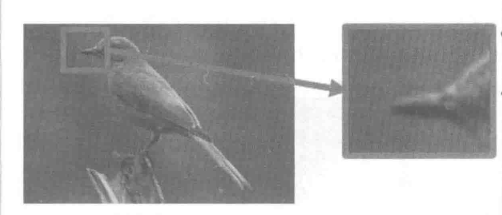
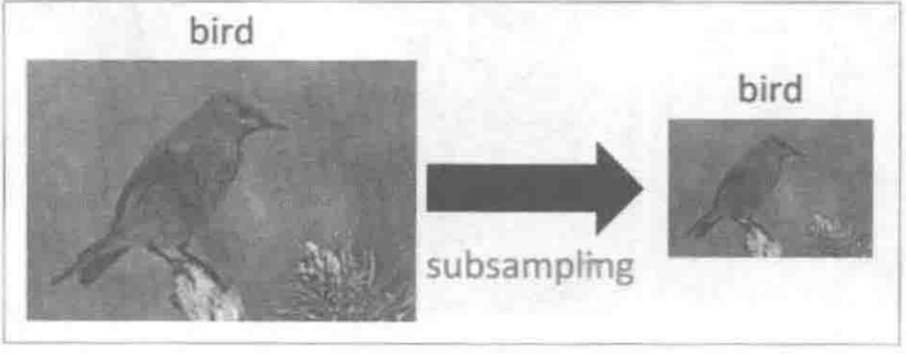

# Pytorch Note26 卷积神经网络

全部笔记的汇总贴：[Pytorch Note 快乐星球](https://blog.csdn.net/weixin_45508265/article/details/117809512)

在卷积神经网络中，有三个观点很重要

## 局部性

对于一张图片而言，需要检测图片中的特征来决定图片的类别，通常情况下这些特征都不是由整张图片决定的，而是由一些局部的区域决定的:

比如下图中的中的鸟喙，该特征只存在于图片的局部中。

##  相同性

对不同图片，如果它们有同样特征，这些特征出现在图片不同的位置，也就是说可用同样的检测模式去检测不同图片的相同特征，不过这些特征处于图片中不同的位置,但是特征检测所做的操作几儿乎一样

比如鸟喙处不同的位置,可用相同的检測模式去检测。

## 不变性

一张大图片,进行下采样,图片性质基本不变。

这三个性质分别对应着卷积神经网络中的三种思想

## 卷积层的性质

这里不详细介绍卷积层了，就给出卷积层的总结的一些性质

（1）输入数据体的尺寸是$W_1 \times H_1 \times D_1$

（2）四个超参数：

- 滤波器数量K
- 滤波器空间尺寸F
- 滑动步长S
- 零填充的数量P

（3）输入数据体的尺寸为$W_2 \times H_2 \times D_2 $，其中$W_2=\frac{W_1-F+2P}{S}+1,H_2=\frac{H_1-F+2P}{S}+1,D_2=K$

（4）由于参数共享,每个滤波器包含的权重数目为$F × F × D_1$,卷积层一共有前面称$F × F × D_1 \times K$ 个权重和K个偏置

（5）在输出体数据中，第$d$个深度切片（空间尺寸是$W_2 \times H_2$），用第$d$个滤波器和输入数据进行有效卷积运算的结果，再加上第$d$个偏置

- 常见的设置是$F=3,S=1,P=1$,同时这些超参数也有一些约定俗成的惯例和经验,在之后的章节介绍

## 池化层的性质

详细可以看[链接](https://blog.csdn.net/Chen_Swan/article/details/105486854)

池化之所以有效，是因为之前介绍的图片特征具有不变性，也就是通过下采样不会丢失图片拥有的特征，由于这种特性,我们可以将图片缩小再进行卷积处理,这样能够大大降低卷积运算的时间。

> 最常用的池化层形式是尺寸为2x2的窗口，滑动步长为2，对图像进行下采样，将其中75%的激活信息都丢掉，选择其中最大的保留下来，这其实是因为我们希望能够更加激活里面的数值大的特征，去除一些噪声信息。

池化层有一些和卷积层类似的性质。

(1)输人数据体的尺寸是$W_1 \times H_1 \times D_1$

(2)有两个需要设置的超参数，空间大小$F$和滑动步长$S$。

(3)输出数据体的尺寸是$W_2 \times H_2 \times D_2$,其中$W_2=\frac{W_1-F}{S}+1,H_2= \frac{H_1-F}{S}+1,D_2=D_1$

(4)对输人进行固定函数的计算，没有参数引人。

(5)池化层中很少引人零填充

在实际中，有两种方式:一种是$F=3,S=2$，这种池化有重叠;另外更常用的一种是$F=2,S=2$，一般来说应该谨慎使用比较大的池化窗口，以免对网络有破坏性。

除了最大值池化之外，还有一些其他的池化函数，比如平均池化，或者L2范数池化。在实际中证明，在卷积层之间引入最大池化的效果是最好的，而平均池化一般放在卷积神经网络的最后一层

## 全连接层

全连接层和之前介绍的一般的神经网络的结构是一样的，每个神经元与前一层所有的神经元全部连接，而卷积神经网络只和输人数据中的一个局部区域连接，并且输出的神经元每个深度切片共享参数。

一般经过了一系列的卷积层和池化层之后，提取出图片的特征图、比如说特征图的大小是3x3x512，这个时候，将特征图中的所有神经元变成全连接层的样子，直观上也就是将一个3D的立方体重新排列,变成一个全连接层，里面有3x3x512=4608个神经元，再经过几个隐藏层，最后输出结果。

在这个过程中为了防止过拟合会引人Dropout。最近的研究表明，在进人全连接层之前，使用全局平均池化能够有效地降低过拟合。

