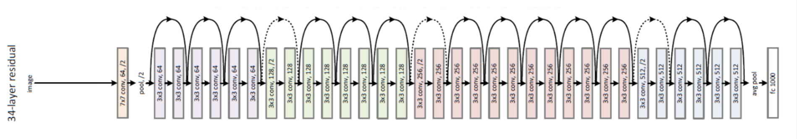
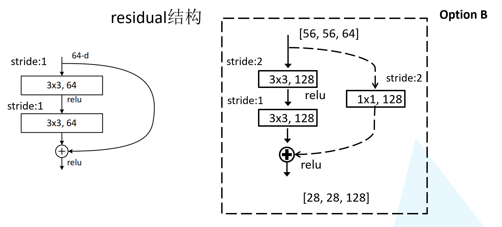
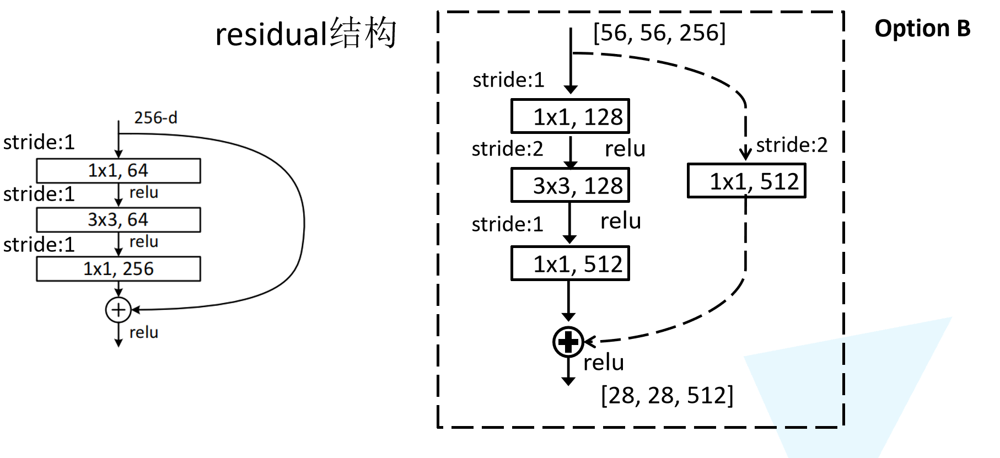
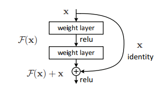
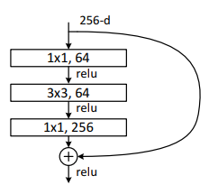

# Pytorch Note31 深度残差网络 ResNet

[toc]

全部笔记的汇总贴：[Pytorch Note 快乐星球](https://blog.csdn.net/weixin_45508265/article/details/117809512)

## ResNet

当大家还在惊叹 GoogLeNet 的 inception 结构的时候，微软亚洲研究院的研究员已经在设计更深但结构更加简单的网络 ResNet，并且凭借这个网络斩获当年ImageNet竞赛中分类任务第一名，目标检测第一名。获得COCO数据集中目标检测第一名，图像分割第一名。

如果想详细了解并查看论文，可以看我的另一篇博客[【论文泛读】 ResNet：深度残差网络](https://blog.csdn.net/weixin_45508265/article/details/119069665)

下图是ResNet18层模型的结构简图


还有ResNet-34模型



在ResNet网络中有如下几个亮点：

（1）提出residual结构（残差结构），并搭建超深的网络结构(突破1000层)

（2）使用Batch Normalization加速训练(丢弃dropout)

在ResNet网络提出之前，传统的卷积神经网络都是通过将一系列卷积层与下采样层进行堆叠得到的。但是当堆叠到一定网络深度时，就会出现两个问题。

（1）梯度消失或梯度爆炸。 

（2）退化问题(degradation problem)。


## 残差结构

在ResNet论文中说通过数据的预处理以及在网络中使用BN（Batch Normalization）层能够解决梯度消失或者梯度爆炸问题，residual结构（残差结构）来减轻退化问题。此时拟合目标就变为F(x)，F(x)就是残差


这里有一个点是很重要的，对于我们的第二个layer，它是没有relu激活函数的，他需要与x相加最后再进行激活函数relu

## ResNet18/34 的Residual结构

我们先对ResNet18/34的残差结构进行一个分析。如下图所示，该残差结构的主分支是由两层3x3的卷积层组成，而残差结构右侧的连接线是shortcut分支也称捷径分支（注意为了让主分支上的输出矩阵能够与我们捷径分支上的输出矩阵进行相加，**必须保证这两个输出特征矩阵有相同的shape**）。我们会发现有一些虚线结构，论文中表述为用1x1的卷积进行降维，下图给出了详细的残差结构。



## ResNet50/101/152的Bottleneck结构

接着我们再来分析下针对ResNet50/101/152的残差结构，如下图所示。在该残差结构当中，主分支使用了三个卷积层，第一个是1x1的卷积层用来压缩channel维度，第二个是3x3的卷积层，第三个是1x1的卷积层用来还原channel维度（注意主分支上第一层卷积层和第二次卷积层所使用的卷积核个数是相同的，第三次是第一层的4倍），这种又叫做bottleneck模型



## ResNet网络结构配置

这是在ImageNet数据集中更深的残差网络的模型，这里面给出了残差结构给出了主分支上卷积核的大小与卷积核个数，表中的xN表示将该残差结构重复N次。


对于我们ResNet18/34/50/101/152，表中conv3_x, conv4_x, conv5_x所对应的一系列残差结构的第一层残差结构都是虚线残差结构。因为这一系列残差结构的第一层都有调整输入特征矩阵shape的使命（将特征矩阵的高和宽缩减为原来的一半，将深度channel调整成下一层残差结构所需要的channel）

- ResNet-50：我们用3层瓶颈块替换34层网络中的每一个2层块，得到了一个50层ResNe。我们使用1x1卷积核来增加维度。该模型有**38亿FLOP**。
- ResNet-101/152：我们通过使用更多的3层瓶颈块来构建101层和152层ResNets。值得注意的是，尽管深度显著增加，但152层ResNet（**113亿FLOP**）仍然比VGG-16/19网络（**153/196亿FLOP**）具有更低的复杂度。

## 代码实现

### BasicBlock



```python
class BasicBlock(nn.Module):
    """
    对于浅层网络，如ResNet-18/34等，用基本的Block
    基础模块没有压缩,所以expansion=1
    """
    expansion = 1
    def __init__(self, in_channels, out_channels, stride=1):
        super(BasicBlock,self).__init__()
        self.features = nn.Sequential(
            nn.Conv2d(in_channels, out_channels, kernel_size=3, stride=stride, padding=1, bias=False),
            nn.BatchNorm2d(out_channels),
            nn.ReLU(True),
            nn.Conv2d(out_channels,out_channels, kernel_size=3, stride=1, padding=1, bias=False),
            nn.BatchNorm2d(out_channels)
        )
        # 如果输入输出维度不等，则使用1x1卷积层来改变维度
        self.shortcut = nn.Sequential()
        if stride != 1 or in_channels != self.expansion * out_channels:
            self.shortcut = nn.Sequential(
                nn.Conv2d(in_channels, self.expansion * out_channels, kernel_size=1, stride=stride, bias=False),
                nn.BatchNorm2d(self.expansion * out_channels),
            )
    def forward(self, x):
        out = self.features(x)
#         print(out.shape)
        out += self.shortcut(x)
        out = torch.relu(out)
        return out
```

### Bottleneck Block



```python
class Bottleneck(nn.Module):
    """
    对于深层网络，我们使用BottleNeck，论文中提出其拥有近似的计算复杂度，但能节省很多资源
    zip_channels: 压缩后的维数，最后输出的维数是 expansion * zip_channels
    针对ResNet50/101/152的网络结构,主要是因为第三层是第二层的4倍的关系所以expansion=4
    """
    expansion = 4
    
    def __init__(self, in_channels, zip_channels, stride=1):
        super(Bottleneck, self).__init__()
        out_channels = self.expansion * zip_channels
        self.features = nn.Sequential(
            nn.Conv2d(in_channels, zip_channels, kernel_size=1, bias=False),
            nn.BatchNorm2d(zip_channels),
            nn.ReLU(inplace=True),
            nn.Conv2d(zip_channels, zip_channels, kernel_size=3, stride=stride, padding=1, bias=False),
            nn.BatchNorm2d(zip_channels),
            nn.ReLU(inplace=True),
            nn.Conv2d(zip_channels, out_channels, kernel_size=1, bias=False),
            nn.BatchNorm2d(out_channels)
        )
        self.shortcut = nn.Sequential()
        if stride != 1 or in_channels != out_channels:
            self.shortcut = nn.Sequential(
                nn.Conv2d(in_channels, out_channels, kernel_size=1, stride=stride, bias=False),
                nn.BatchNorm2d(out_channels)
            )
            
    def forward(self, x):
        out = self.features(x)
#         print(out.shape)
        out += self.shortcut(x)
        out = torch.relu(out)
        return out
```


### ResNet


```python
class ResNet(nn.Module):
    """
    不同的ResNet架构都是统一的一层特征提取、四层残差，不同点在于每层残差的深度。
    对于cifar10，feature map size的变化如下：
    (32, 32, 3) -> [Conv2d] -> (32, 32, 64) -> [Res1] -> (32, 32, 64) -> [Res2] 
 -> (16, 16, 128) -> [Res3] -> (8, 8, 256) ->[Res4] -> (4, 4, 512) -> [AvgPool] 
 -> (1, 1, 512) -> [Reshape] -> (512) -> [Linear] -> (10)
    """
    def __init__(self, block, num_blocks, num_classes=10, verbose = False):
        super(ResNet, self).__init__()
        self.verbose = verbose
        self.in_channels = 64
        self.features = nn.Sequential(
            nn.Conv2d(3, 64, kernel_size=3, stride=1, padding=1, bias=False),
            nn.BatchNorm2d(64),
            nn.ReLU(inplace=True)
        )
        #使用_make_layer函数生成上表对应的conv2_x, conv3_x, conv4_x, conv5_x的结构
        self.layer1 = self._make_layer(block, 64, num_blocks[0], stride=1)
        self.layer2 = self._make_layer(block, 128, num_blocks[1], stride=2)
        self.layer3 = self._make_layer(block, 256, num_blocks[2], stride=2)
        self.layer4 = self._make_layer(block, 512, num_blocks[3], stride=2)
        # cifar10经过上述结构后，到这里的feature map size是 4 x 4 x 512 x expansion
        # 所以这里用了 4 x 4 的平均池化
        self.avg_pool = nn.AvgPool2d(kernel_size=4)
        self.classifer = nn.Linear(512 * block.expansion, num_classes)
        
    def _make_layer(self, block, out_channels, num_blocks, stride):
        # 第一个block要进行降采样
        strides = [stride] + [1] * (num_blocks - 1)
        layers = []
        for stride in strides:
            layers.append(block(self.in_channels, out_channels, stride))
            # 如果是Bottleneck Block的话需要对每层输入的维度进行压缩，压缩后再增加维数
            # 所以每层的输入维数也要跟着变
            self.in_channels = out_channels * block.expansion
        return nn.Sequential(*layers)
    
    def forward(self, x):
        out = self.features(x)
        if self.verbose:
            print('block 1 output: {}'.format(out.shape))
        out = self.layer1(out)        
        if self.verbose:
            print('block 2 output: {}'.format(out.shape))
        out = self.layer2(out)
        if self.verbose:
            print('block 3 output: {}'.format(out.shape))
        out = self.layer3(out)
        if self.verbose:
            print('block 4 output: {}'.format(out.shape))
        out = self.layer4(out)
        if self.verbose:
            print('block 5 output: {}'.format(out.shape))
        out = self.avg_pool(out)
        out = out.view(out.size(0), -1)
        out = self.classifer(out)
        return out
```

```python
def ResNet18(verbose=False):
    return ResNet(BasicBlock, [2,2,2,2],verbose=verbose)

def ResNet34(verbose=False):
    return ResNet(BasicBlock, [3,4,6,3],verbose=verbose)

def ResNet50(verbose=False):
    return ResNet(Bottleneck, [3,4,6,3],verbose=verbose)

def ResNet101(verbose=False):
    return ResNet(Bottleneck, [3,4,23,3],verbose=verbose)

def ResNet152(verbose=False):
    return ResNet(Bottleneck, [3,8,36,3],verbose=verbose)
```

接下来可以测试一下

```python
net = ResNet18(True).to(device)
# print(net)
# 测试
x = torch.randn(2, 3, 32, 32).to(device)
y = net(x)
print(y.shape)
```

```python
block 1 output: torch.Size([2, 64, 32, 32])
block 2 output: torch.Size([2, 64, 32, 32])
block 3 output: torch.Size([2, 128, 16, 16])
block 4 output: torch.Size([2, 256, 8, 8])
block 5 output: torch.Size([2, 512, 4, 4])
torch.Size([2, 10])
```

可以看得出来，是没有问题，接着我将ResNet34对我们的CIFAR-10数据进行图像分类

```python
from train import *
train(net,trainloader,testloader,epoch,optimizer,criterion,scheduler,save_path)
```


```python
 Epoch [  1/100 ]  train_loss:1.859971  train_acc:32.70%  test_loss:1.527176  test_acc:44.09%  	Time 01:36
 Epoch [  2/100 ]  train_loss:1.385657  train_acc:48.99%  test_loss:1.305144  test_acc:53.10%  	Time 01:33
 Epoch [  3/100 ]  train_loss:1.138726  train_acc:59.21%  test_loss:1.060824  test_acc:62.54%  	Time 01:32
 Epoch [  4/100 ]  train_loss:0.957052  train_acc:65.87%  test_loss:0.901536  test_acc:67.65%  	Time 01:33
 Epoch [  5/100 ]  train_loss:0.823069  train_acc:70.95%  test_loss:0.831492  test_acc:71.23%  	Time 01:34
 Epoch [  6/100 ]  train_loss:0.699931  train_acc:75.53%  test_loss:0.734159  test_acc:74.29%  	Time 01:39
 Epoch [  7/100 ]  train_loss:0.623978  train_acc:78.34%  test_loss:0.675511  test_acc:76.53%  	Time 01:45
 Epoch [  8/100 ]  train_loss:0.558022  train_acc:80.73%  test_loss:0.577426  test_acc:80.04%  	Time 01:47
 Epoch [  9/100 ]  train_loss:0.504705  train_acc:82.56%  test_loss:0.526622  test_acc:82.42%  	Time 01:44
 Epoch [ 10/100 ]  train_loss:0.467333  train_acc:83.67%  test_loss:0.518429  test_acc:81.89%  	Time 01:45
 Epoch [ 11/100 ]  train_loss:0.430984  train_acc:85.13%  test_loss:0.483581  test_acc:83.91%  	Time 01:43
 Epoch [ 12/100 ]  train_loss:0.403238  train_acc:86.18%  test_loss:0.455750  test_acc:84.33%  	Time 01:45
 Epoch [ 13/100 ]  train_loss:0.376863  train_acc:87.05%  test_loss:0.456595  test_acc:84.32%  	Time 01:46
 Epoch [ 14/100 ]  train_loss:0.373187  train_acc:87.17%  test_loss:0.440933  test_acc:85.21%  	Time 01:43
 Epoch [ 15/100 ]  train_loss:0.351715  train_acc:87.87%  test_loss:0.418130  test_acc:86.15%  	Time 01:47
 Epoch [ 16/100 ]  train_loss:0.334451  train_acc:88.52%  test_loss:0.431225  test_acc:85.24%  	Time 01:45
 Epoch [ 17/100 ]  train_loss:0.332432  train_acc:88.62%  test_loss:0.385285  test_acc:87.20%  	Time 01:46
 Epoch [ 18/100 ]  train_loss:0.316564  train_acc:88.98%  test_loss:0.400926  test_acc:86.70%  	Time 01:44
 Epoch [ 19/100 ]  train_loss:0.312601  train_acc:89.19%  test_loss:0.415047  test_acc:85.62%  	Time 01:46
 Epoch [ 20/100 ]  train_loss:0.301724  train_acc:89.60%  test_loss:0.450504  test_acc:85.00%  	Time 01:45
```

ResNet 使用跨层通道使得训练非常深的卷积神经网络成为可能。同样它使用很简单的卷积层配置，使得其拓展更加简单。

从结果可以看出，我们的ResNet34经过20次迭代，就达到了85的准确率，它的收敛速度是很快的，而且也不会出现退化和梯度消失的问题

如果想详细了解利用pytorch和ResNet在CIFAR-10上的详细代码和解释，可以持续关注我的[博客](https://blog.csdn.net/weixin_45508265)

