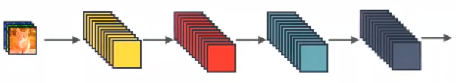
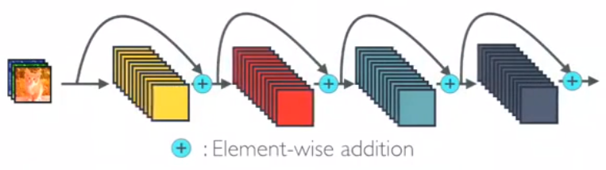
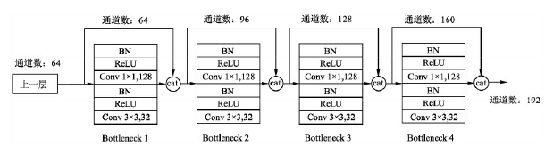
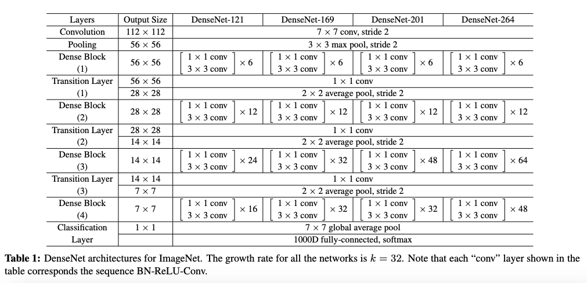
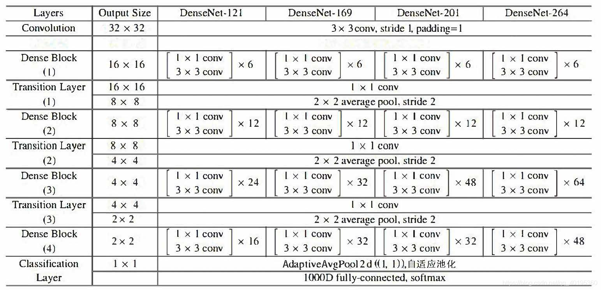

# Pytorch Note32 稠密连接的卷积网络 DenseNet

[toc]

全部笔记的汇总贴：[Pytorch Note 快乐星球](https://blog.csdn.net/weixin_45508265/article/details/117809512)

## DenseNet

之前的ResNet通过前层与后层的“短路连接”（Shortcuts），加强了前后层之间的信息流通，在一定程度上缓解了梯度消失现象，从而**可以将神经网络搭建得很深**。更进一步，DenseNet最大化了这种前后层信息交流，通过建立**前面所有层与后面层的密集连接**，实现了特征在通道维度上的复用，使其可以在参数与计算量更少的情况下实现比ResNet更优的性能。如果想详细了解并查看论文，可以看我的另一篇博客[【论文泛读】 DenseNet：稠密连接的卷积网络](https://blog.csdn.net/weixin_45508265/article/details/119069665)

DenseNet 和 ResNet 不同在于 ResNet 是跨层求和，而 DenseNet 是跨层将特征在通道维度进行拼接，下面可以看看他们两者的图示

这个是最标准的卷积神经网络



这是ResNet，是跨层求和



这个就是DenseNet，是跨层将特征在通道维度进行拼接


## Dense Block

DenseNet的网络架构如下图所示，了便于下采样的实现，我们将网络划分为多个稠密连接的dense block，网络由多个Dense Block与中间的卷积池化组成，核心就在Dense Block中。Dense Block中的黑点代表一个卷积层，其中的多条黑线代表数据的流动，每一层的输入由前面的所有卷积层的输出组成。注意这里使用了通道拼接（Concatnate）操作，而非ResNet的逐元素相加操作。


我们将每个block之间的层称为过渡层，完成卷积和池化的操作。在我们的实验中，过渡层由BN层、1x1卷积层和2x2平均池化层组成。


具体的Block实现细节如下图所示，每一个Block由若干个Bottleneck的卷积层组成，对应上面图中的黑点。Bottleneck由BN、ReLU、1×1卷积、BN、ReLU、3×3卷积的顺序构成，也被称为DenseNet-B结构。其中1x1 Conv得到 4k 个特征图它起到的作用是降低特征数量，从而提升计算效率。



关于Block，有以下4个细节需要注意：

1. 每一个Bottleneck输出的特征通道数是相同的，例如这里的32。同时可以看到，经过Concatnate操作后的通道数是按32的增长量增加的，因此这个32也被称为GrowthRate。
2. 这里1×1卷积的作用是固定输出通道数，达到降维的作用。当几十个Bottleneck相连接时，Concatnate后的通道数会增加到上千，如果不增加1×1的卷积来降维，后续3×3卷积所需的参数量会急剧增加。1×1卷积的通道数通常是GrowthRate的4倍。
3. 上图中的特征传递方式是直接将前面所有层的特征Concatnate后传到下一层，这种方式与具体代码实现的方式是一致的。
4. Block采用了激活函数在前、卷积层在后的顺序，这与一般的网络上是不同的。


## DenseNet 的网络结构

在ImageNet数据集上的网络如下图所示



## 代码实现

由于我是对CIFAR进行实验，而论文中给出的是ImageNet的网络模型，所以由于数据集的不同，模型稍微有些不同



### Bottleneck

```python
class Bottleneck(nn.Module):
    """
    Dense Block
    这里的growth_rate=out_channels, 就是每个Block自己输出的通道数。
    先通过1x1卷积层，将通道数缩小为4 * growth_rate，然后再通过3x3卷积层降低到growth_rate。
    """
    # 通常1×1卷积的通道数为GrowthRate的4倍
    expansion = 4
    
    def __init__(self, in_channels, growth_rate):
        super(Bottleneck, self).__init__()
        zip_channels = self.expansion * growth_rate
        self.features = nn.Sequential(
            nn.BatchNorm2d(in_channels),
            nn.ReLU(True),
            nn.Conv2d(in_channels, zip_channels, kernel_size=1, bias=False),
            nn.BatchNorm2d(zip_channels),
            nn.ReLU(True),
            nn.Conv2d(zip_channels, growth_rate, kernel_size=3, padding=1, bias=False)
        )
        
    def forward(self, x):
        out = self.features(x)
        out = torch.cat([out, x], 1)
        return out        
```


### Transition

```python
class Transition(nn.Module):
    """
    改变维数的Transition层 具体包括BN、ReLU、1×1卷积（Conv）、2×2平均池化操作
    先通过1x1的卷积层减少channels，再通过2x2的平均池化层缩小feature-map
    """
    # 1×1卷积的作用是降维，起到压缩模型的作用，而平均池化则是降低特征图的尺寸。
    def __init__(self, in_channels, out_channels):
        super(Transition, self).__init__()
        self.features = nn.Sequential(
            nn.BatchNorm2d(in_channels),
            nn.ReLU(True),
            nn.Conv2d(in_channels, out_channels, kernel_size=1, bias=False),
            nn.AvgPool2d(2)
        )
        
    def forward(self, x):
        out = self.features(x)
        return out
```


### DenseNet

```python
# DesneNet-BC
# B 代表 bottleneck layer(BN-RELU-CONV(1x1)-BN-RELU-CONV(3x3))
# C 代表压缩系数(0<=theta<=1)
import math
class DenseNet(nn.Module):
    """
    Dense Net
    paper中growth_rate取12，维度压缩的参数θ，即reduction取0.5
    且初始化方法为kaiming_normal()
    num_blocks为每段网络中的DenseBlock数量
    DenseNet和ResNet一样也是六段式网络（一段卷积+四段Dense+平均池化层），最后FC层。
    第一段将维数从3变到2 * growth_rate
    
    (3, 32, 32) -> [Conv2d] -> (24, 32, 32) -> [layer1] -> (48, 16, 16) -> [layer2]
  ->(96, 8, 8) -> [layer3] -> (192, 4, 4) -> [layer4] -> (384, 4, 4) -> [AvgPool]
  ->(384, 1, 1) -> [Linear] -> (10)
    
    """
    def __init__(self, num_blocks, growth_rate=12, reduction=0.5, num_classes=10):
        super(DenseNet, self).__init__()
        self.growth_rate = growth_rate
        self.reduction = reduction
        
        num_channels = 2 * growth_rate
        
        self.features = nn.Conv2d(3, num_channels, kernel_size=3, padding=1, bias=False)
        self.layer1, num_channels = self._make_dense_layer(num_channels, num_blocks[0])
        self.layer2, num_channels = self._make_dense_layer(num_channels, num_blocks[1])
        self.layer3, num_channels = self._make_dense_layer(num_channels, num_blocks[2])
        self.layer4, num_channels = self._make_dense_layer(num_channels, num_blocks[3], transition=False)
        self.avg_pool = nn.Sequential(
            nn.BatchNorm2d(num_channels),
            nn.ReLU(True),
            nn.AvgPool2d(4),
        )
        self.classifier = nn.Linear(num_channels, num_classes)
        
        self._initialize_weight()
        
    def _make_dense_layer(self, in_channels, nblock, transition=True):
        layers = []
        for i in range(nblock):
            layers += [Bottleneck(in_channels, self.growth_rate)]
            in_channels += self.growth_rate
        out_channels = in_channels
        if transition:
            out_channels = int(math.floor(in_channels * self.reduction))
            layers += [Transition(in_channels, out_channels)]
        return nn.Sequential(*layers), out_channels
    
    def _initialize_weight(self):
        for m in self.modules():
            if isinstance(m, nn.Conv2d):
                nn.init.kaiming_normal_(m.weight.data)
                if m.bias is not None:
                    m.bias.data.zero_()
    
    def forward(self, x):
        out = self.features(x)
        out = self.layer1(out)
        out = self.layer2(out)
        out = self.layer3(out)
        out = self.layer4(out)
        out = self.avg_pool(out)
        out = out.view(out.size(0), -1)
        out = self.classifier(out)
        return out
```

```python
def DenseNet121():
    return DenseNet([6,12,24,16], growth_rate=32)

def DenseNet169():
    return DenseNet([6,12,32,32], growth_rate=32)

def DenseNet201():
    return DenseNet([6,12,48,32], growth_rate=32)

def DenseNet161():
    return DenseNet([6,12,36,24], growth_rate=48)

def densenet_cifar():
    return DenseNet([6,12,24,16], growth_rate=12)

net = DenseNet121().to(device)
```

接下来可以测试一下

```python
# 测试
x = torch.randn(2, 3, 32, 32).to(device)
y = net(x)
print(y.shape)
```

```python
torch.Size([2, 10])
```

可以看得出来，是没有问题，接着我将DenseNet121对我们的CIFAR-10数据进行图像分类

```python
from utils import train
from utils import plot_history
Acc, Loss, Lr = train(net, trainloader, testloader, epoch, optimizer, criterion, scheduler, save_path, verbose = True)
```

```python
Epoch [  1/ 20]  Train Loss:1.457685  Train Acc:46.79% Test Loss:1.159939  Test Acc:58.61%  Learning Rate:0.100000	Time 03:26
Epoch [  2/ 20]  Train Loss:0.918042  Train Acc:67.23% Test Loss:0.978080  Test Acc:66.76%  Learning Rate:0.100000	Time 03:26
Epoch [  3/ 20]  Train Loss:0.713618  Train Acc:75.13% Test Loss:0.702649  Test Acc:75.79%  Learning Rate:0.100000	Time 03:14
Epoch [  4/ 20]  Train Loss:0.586451  Train Acc:79.65% Test Loss:0.621467  Test Acc:78.59%  Learning Rate:0.100000	Time 03:21
Epoch [  5/ 20]  Train Loss:0.516065  Train Acc:82.01% Test Loss:0.571210  Test Acc:80.01%  Learning Rate:0.100000	Time 03:21
Epoch [  6/ 20]  Train Loss:0.470830  Train Acc:83.65% Test Loss:0.538970  Test Acc:81.71%  Learning Rate:0.100000	Time 03:26
Epoch [  7/ 20]  Train Loss:0.424286  Train Acc:85.22% Test Loss:0.497426  Test Acc:82.99%  Learning Rate:0.100000	Time 03:10
Epoch [  8/ 20]  Train Loss:0.398347  Train Acc:86.05% Test Loss:0.481514  Test Acc:83.75%  Learning Rate:0.100000	Time 03:33
Epoch [  9/ 20]  Train Loss:0.375151  Train Acc:86.94% Test Loss:0.484835  Test Acc:83.61%  Learning Rate:0.100000	Time 03:40
Epoch [ 10/ 20]  Train Loss:0.355356  Train Acc:87.74% Test Loss:0.495134  Test Acc:83.57%  Learning Rate:0.100000	Time 03:33
Epoch [ 11/ 20]  Train Loss:0.241889  Train Acc:91.73% Test Loss:0.331097  Test Acc:88.66%  Learning Rate:0.010000	Time 03:37
Epoch [ 12/ 20]  Train Loss:0.211223  Train Acc:92.83% Test Loss:0.320972  Test Acc:89.12%  Learning Rate:0.010000	Time 03:22
Epoch [ 13/ 20]  Train Loss:0.195006  Train Acc:93.34% Test Loss:0.306602  Test Acc:89.39%  Learning Rate:0.010000	Time 03:09
Epoch [ 14/ 20]  Train Loss:0.183884  Train Acc:93.63% Test Loss:0.306510  Test Acc:89.98%  Learning Rate:0.010000	Time 03:12
Epoch [ 15/ 20]  Train Loss:0.174167  Train Acc:93.99% Test Loss:0.297684  Test Acc:90.17%  Learning Rate:0.010000	Time 03:22
Epoch [ 16/ 20]  Train Loss:0.159896  Train Acc:94.58% Test Loss:0.299201  Test Acc:89.86%  Learning Rate:0.001000	Time 04:30
Epoch [ 17/ 20]  Train Loss:0.158322  Train Acc:94.60% Test Loss:0.308903  Test Acc:90.05%  Learning Rate:0.001000	Time 06:31
Epoch [ 18/ 20]  Train Loss:0.152777  Train Acc:94.76% Test Loss:0.301876  Test Acc:89.98%  Learning Rate:0.001000	Time 03:08
Epoch [ 19/ 20]  Train Loss:0.152887  Train Acc:94.78% Test Loss:0.308110  Test Acc:89.77%  Learning Rate:0.001000	Time 03:11
Epoch [ 20/ 20]  Train Loss:0.150318  Train Acc:94.95% Test Loss:0.301545  Test Acc:90.06%  Learning Rate:0.001000	Time 03:06
```

DenseNet 将残差连接改为了特征拼接，使得网络有了更稠密的连接

如果想详细了解利用pytorch和ResNet在CIFAR-10上的详细代码和解释，可以持续关注我的[博客](https://blog.csdn.net/weixin_45508265)

