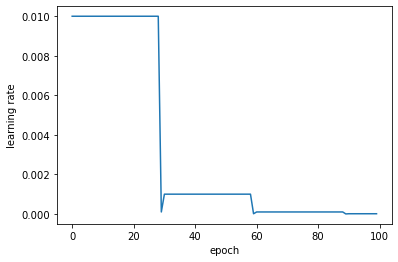
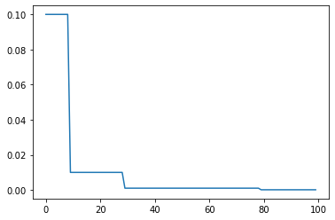
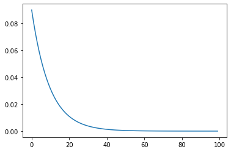
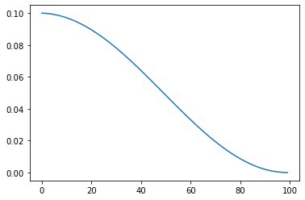

# Pytorch Note34 学习率衰减

[toc]

全部笔记的汇总贴：[Pytorch Note 快乐星球](https://blog.csdn.net/weixin_45508265/article/details/117809512)

对于基于一阶梯度进行优化的方法而言，开始的时候更新的幅度是比较大的，也就是说开始的学习率可以设置大一点，但是当训练集的 loss 下降到一定程度之后，，使用这个太大的学习率就会导致 loss 一直来回震荡，比如


在之前，我们会选择好一点的优化算法，但是无论是什么优化算法都有可能会出现这种问题，如果把学习率调的很小，最优化的时间又会很大，这个时候就需要对学习率进行衰减已达到 loss 的充分下降，而是用学习率衰减的办法能够解决这个矛盾，学习率衰减就是随着训练的进行不断的减小学习率。

在 pytorch 中学习率衰减非常方便，使用 `torch.optim.lr_scheduler`，更多的信息可以直接查看[官方文档](http://pytorch.org/docs/0.3.0/optim.html#how-to-adjust-learning-rate)


一般来说，pytorch有两种学习率调整(衰减)方法：

- 使用库函数进行调整
- 手动调整

## 使用库函数调整学习率

PyTorch学习率调整策略通过`torch.optim.lr_scheduler`接口实现。PyTorch提供的学习率调整策略分为三大类，分别是

1. 有序调整：等间隔调整(Step)，按需调整学习率(MultiStep)，指数衰减调整(Exponential)和余弦退火CosineAnnealing。
2. 自适应调整：自适应调整学习率 ReduceLROnPlateau。
3. 自定义调整：自定义调整学习率 LambdaLR。


### scheduler.step()

在每个epoch的训练中，使用scheduler.step()语句进行学习率更新，此方法类似于optimizer.step()更新模型参数，即一次epoch对应一次scheduler.step()。


### 等间隔调整学习率 StepLR

等间隔调整学习率，调整倍数为 gamma 倍，调整间隔为 step_size。间隔单位是step，一般来说，step通常是指epoch，而不是iteration

简单点来说，就是每训练step_size个**epoch**，学习率调整为lr=lr*gamma。


```python
torch.optim.lr_scheduler.StepLR(optimizer, step_size, gamma=0.1, last_epoch=-1)
```

参数：

- optimizer: 神经网络训练中使用的优化器，如optimizer=torch.optim.SGD(...)

- step_size(int): 学习率下降间隔数，单位是epoch，而不是iteration。比如若为30，则会在30、60、90…个step时，将学习率调整为lr*gamm

- gamma(float): 学习率调整倍数，默认为0.1，即下降10倍

- last_epoch(int): 上一个epoch数，这个变量用来指示学习率是否需要调整。其实就是最后一个epoch的index，如果是训练了很多个epoch后中断了，继续训练，这个值就等于加载的模型的epoch。默认为-1表示从头开始训练，即从epoch=1开始。



### 按需调整学习率 MultiStepLR

与StepLR类似，但是它们的区别是调节的epoch是自己定义，无需一定是等差数列，比如[30, 60, 90,...]

这个方法适合后期调试使用，观察 loss 曲线，为每个实验定制学习率调整时机。

```python
torch.optim.lr_sheduler.MultiStepLR(optimizer, milestones, gamma=0.1, last_epoch=-1)
```

参数：

- optimizer: 神经网络训练中使用的优化器，如optimizer=torch.optim.SGD(...)

- milestone(list): 一个列表参数，表示多个学习率需要调整的epoch值，如milestones=[10, 30, 80]，就说明在第10，第30，第80个epoch进行改变

- gamma(float): 学习率调整倍数，默认为0.1，即下降10倍

- last_epoch(int): 上一个epoch数，这个变量用来指示学习率是否需要调整。其实就是最后一个epoch的index，如果是训练了很多个epoch后中断了，继续训练，这个值就等于加载的模型的epoch。默认为-1表示从头开始训练，即从epoch=1开始。



### 指数衰减调整学习率 ExponentialLR

学习率呈指数型衰减，每训练一个epoch，$lr=lr \times gamma^{epoch}$

```python
torch.optim.lr_sheduler.ExponentialLR(optimizer, gamma, last_epoch)
```

参数：

- optimizer: 神经网络训练中使用的优化器，如optimizer=torch.optim.SGD(...)

- gamma(float)：学习率调整倍数的底数，指数为epoch，初始值我lr, 倍数为$gamma^{epoch}$

- last_epoch(int): 上一个epoch数，这个变量用来指示学习率是否需要调整。其实就是最后一个epoch的index，如果是训练了很多个epoch后中断了，继续训练，这个值就等于加载的模型的epoch。默认为-1表示从头开始训练，即从epoch=1开始。



### 余弦退火函数调整学习率 CosineAnnealingLR

以余弦函数为周期，并在每个周期最大值时重新设置学习率。以初始学习率为最大学习率，以 2∗Tmax 为周期，在一个周期内先下降，后上升。

```python
torch.optim.lr_sheduler.CosineAnnealingLR(optimizer, T_max, eta_min=0, last_epoch=-1)
```

参数：

- T_max(int)：学习率下降到最小值时的epoch数，即当epoch=T_max时，学习率下降到余弦函数最小值，当epoch>T_max时，学习率将增大
- eta_min(float)： 学习率调整的最小值，即在一个周期中，学习率最小会下降到 eta_min，默认值为 0。




### 根据指标调整学习率 ReduceLROnPlateau

当某指标(loss或accuracy)在最近几个epoch中都没有变化(下降或升高超过给定阈值)时，调整学习率。

 如当验证集的loss不再下降时，调整学习率；或当验证集的accuracy不再升高时，调整学习率。

```python
torch.optim.lr_sheduler.ReduceLROnPlateau(optimizer, mode='min', factor=0.1, patience=10,
 verbose=False, threshold=0.0001, threshold_mode='rel', cooldown=0, min_lr=0, eps=1e-08)
```

参数：

- mode(str): 模式选择，有min和max两种模式，min表示当指标不再降低(如监测loss)，max表示当指标不再升高(如监测accuracy)
- factor(float): 学习率调整倍数，同前面的gamma，当监测指标达到要求时，lr=lr×factor。
- patience(int): 忍受该指标多少个epoch不变化，当忍无可忍时，调整学习率。
- verbose(bool): 是否打印学习率信息，print( 'Epoch {:5d} reducing learning rate of group {} to {:.4e}.'.format(epoch, i, new_lr), 默认为False, 即不打印该信息。
- threshold_mode (str): 选择判断指标是否达最优的模式，有两种模式：rel 和 abs.
   当threshold_mode == rel, 并且 mode == max时，dynamic_threshold = best * (1 + threshold);
   当threshold_mode == rel, 并且 mode == min时，dynamic_threshold = best * (1 - threshold);
   当threshold_mode == abs, 并且 mode == max时，dynamic_threshold = best + threshold;
   当threshold_mode == abs, 并且 mode == min时，dynamic_threshold = best - threshold;
- threshold(float): 配合threshold_mode使用。
- cooldown(int): “冷却时间”，当调整学习率之后，让学习率调整策略冷静一下，让模型在训练一段时间，再重启监测模式。
- min_lr(float or list): 学习率下限，可为float，或者list，当有多个参数组时，可用list进行设置。
- eps(float): 学习率**衰减的最小值**，当学习率的**变化值**小于eps时，则不调整学习率。


### 自定义调整学习率 LambdaLR

为不同参数组设定不同学习率调整策略。调整规则为，
$$
lr=base\_lr∗lambda(self.last\_epoch)
$$
fine-tune 中十分有用，我们不仅可为不同的层设定不同的学习率，还可以为其设定不同的学习率调整策略。

```python
torch.optim.lr_scheduler.LambdaLR(optimizer, lr_lambda, last_epoch=-1)
```

参数：

- lr_lambda(function or list): 自定义计算学习率调整倍数的函数，通常时epoch的函数，当有多个参数组时，设为list.
- last_epoch (int) – 上一个 epoch 数，这个变量用来指示学习率是否需要调整。当last_epoch 符合设定的间隔时，就会对学习率进行调整。当为-1 时，学习率设置为初始值。


## 手动调整学习率

手动调整学习率，通常可以定义如下函数：

```python
def adjust_learning_rate(optimizer, epoch):
    """Sets the learning rate to the initial LR decayed by 10 every 30 epochs"""
    lr = args.lr * (0.1 ** (epoch // 30))
    for param_group in optimizer.param_groups:
        param_group['lr'] = lr
```

```python
def adjust_learning_rate(epoch, lr):
    if epoch <= 81:  # 32k iterations
      return lr
    elif epoch <= 122:  # 48k iterations
      return lr/10
    else:
      return lr/100
```

该函数通过修改每个epoch下，各参数组中的lr来进行学习率手动调整，用法如下：

```python
for epoch in range(epochs):
    lr = adjust_learning_rate(optimizer, epoch)  # 调整学习率
    optimizer = optim.SGD(net.parameters(), lr=lr, momentum=0.9, weight_decay=5e-4)
    ......
    optimizer.step()  # 采用新的学习率进行参数更新
```

附：给出画上述学习率变化图的程序：

```python
import torch
import torch.optim as optim
from torch.optim import lr_scheduler
from torchvision.models import AlexNet
import matplotlib.pyplot as plt 


model = AlexNet(num_classes=2)
optimizer = optim.SGD(params=model.parameters(), lr=0.1)

# 等间隔调整学习率，每训练step_size个epoch，lr*gamma
# scheduler = lr_scheduler.StepLR(optimizer, step_size=30, gamma=0.1)

# 多间隔调整学习率，每训练至milestones中的epoch，lr*gamma
# scheduler = lr_scheduler.MultiStepLR(optimizer, milestones=[10, 30, 80], gamma=0.1)

# 指数学习率衰减，lr*gamma**epoch
# scheduler = lr_scheduler.ExponentialLR(optimizer, gamma=0.9)

# 余弦退火学习率衰减，T_max表示半个周期，lr的初始值作为余弦函数0处的极大值逐渐开始下降，
# 在epoch=T_max时lr降至最小值，即pi/2处，然后进入后半个周期，lr增大
# scheduler = lr_scheduler.CosineAnnealingLR(optimizer, T_max=100, eta_min=0)

plt.figure()
x = list(range(100))
y = []
for epoch in range(100):
    scheduler.step()
    y.append(scheduler.get_lr()[0])

plt.plot(x, y)
plt.show()
```


## 得到学习率

optimizer通过param_group来管理参数组.param_group中保存了参数组及其对应的学习率,动量等等.所以我们可以通过更改param_group['lr']的值来更改对应参数组的学习率。

aijust_learning_rate() 函数就是通过for循环遍历取出每一个param_group，然后修改其中的键 'lr' 的值，称之为手动调整学习率

这个参数组是一个字典，里面有很多属性，比如学习率，权重衰减等等，我们可以访问以下

```python
print('learning rate: {}'.format(optimizer.param_groups[0]['lr']))
print('weight decay: {}'.format(optimizer.param_groups[0]['weight_decay']))
```

```python
learning rate: 0.01
weight decay: 0.0001
```

如果想要每次迭代都实时打印学习率，这样可以每次step都能知道更新的最新学习率，也可以使用

```python
scheduler.get_lr()
```

它返回一个学习率列表，由参数组中的不同学习率组成，可通过列表索引来得到不同参数组中的学习率。

