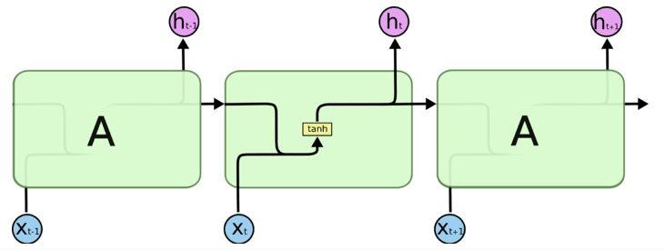
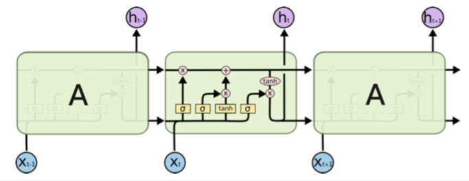
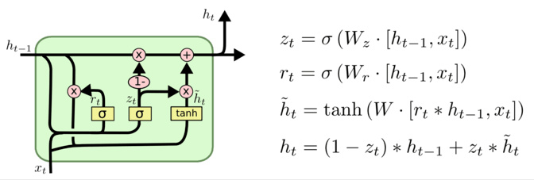

# Pytorch Note37 PyTorch 中的循环神经网络模块

[toc]
全部笔记的汇总贴：[Pytorch Note 快乐星球](https://blog.csdn.net/weixin_45508265/article/details/117809512)

## 标准RNN




在标准的RNN的内部网络中，计算公式如下:
$$
h_t=\tanh(w_{ih}*x_t+b_{ih}+w_{hh}*h_{t-1}+b_{hh})
$$
对于最简单的 RNN，我们可以使用下面两种方式去调用，分别是 `torch.nn.RNNCell()` 和 `torch.nn.RNN()`，这两种方式的区别在于 `RNNCell()` 只能接受序列中单步的输入，且必须传入隐藏状态，而 `RNN()` 可以接受一个序列的输入，默认会传入全 0 的隐藏状态，也可以自己申明隐藏状态传入。

`RNN()` 里面的参数有

- input_size 表示输入 $x_t$ 的特征维度

- hidden_size 表示输出的特征维度

- num_layers 表示网络的层数

- nonlinearity 表示选用的非线性激活函数，默认是 'tanh'

- bias 表示是否使用偏置，默认是True，使用

- batch_first 表示输入数据的形式，默认是 False，就是这样形式，(seq, batch, feature)，也就是将序列长度放在第一位，batch 放在第二位

- dropout 表示是否在输出层应用 dropout，是0~1的数值

- bidirectional 表示是否使用双向的 rnn，默认是 False

对于 `RNNCell()`，里面的参数就少很多，只有 input_size，hidden_size，bias 以及 nonlinearity

### RNNCell

```python
# 定义一个单步的 rnn
rnn_single = nn.RNNCell(input_size=100, hidden_size=200)
```

```python
# 访问其中的参数
rnn_single.weight_hh.shape
```

> torch.Size([200, 200])

```python
# 构造一个序列，长为 6，batch 是 5， 特征是 100
x = Variable(torch.randn(6, 5, 100)) # 这是 rnn 的输入格式

# 定义初始的记忆状态
h_t = Variable(torch.zeros(5, 200))
```

```python
# 传入 rnn
out = []
for i in range(6): # 通过循环 6 次作用在整个序列上
    h_t = rnn_single(x[i], h_t)
    out.append(h_t)
```

```python
h_t.shape
```

> torch.Size([5, 200])

```python
len(out)
```

> 6

```python
out[0].shape # 每个输出的维度
```

> torch.Size([5, 200])

可以看到经过了 rnn 之后，隐藏状态的值已经被改变了，因为网络记忆了序列中的信息，同时输出 6 个结果

### RNN

下面我们看看直接使用 `RNN` 的情况

```python
rnn_seq = nn.RNN(100, 200)
```

```python
out, h_t = rnn_seq(x) # 使用默认的全 0 隐藏状态
h_t.shape
```

> torch.Size([1, 5, 200])

```python
len(out)
```

> 6

这里的 h_t 是网络最后的隐藏状态，网络也输出了 6 个结果

```python
# 自己定义初始的隐藏状态
h_0 = Variable(torch.randn(1, 5, 200))
```

这里的隐藏状态的大小有三个维度，分别是 (num_layers * num_direction, batch, hidden_size)

```python
out, h_t = rnn_seq(x, h_0)
h_t.shape,out.shape
```

> torch.Size([1, 5, 200]),torch.Size([6, 5, 200])

同时输出的结果也是 (seq, batch, feature)

一般情况下我们都是用 `nn.RNN()` 而不是 `nn.RNNCell()`，因为 `nn.RNN()` 能够避免我们手动写循环，非常方便，同时如果不特别说明，我们也会选择使用默认的全 0 初始化隐藏状态

## LSTM




LSTM 和基本的 RNN 是一样的，他的参数也是相同的，同时他也有 `nn.LSTMCell()` 和 `nn.LSTM()` 两种形式，跟前面讲的都是相同的，我们就不再赘述了，下面直接举个小例子

```python
lstm_seq = nn.LSTM(50, 100, num_layers=2) # 输入维度 100，输出 200，两层
```

```python
lstm_seq.weight_hh_l0.shape
```

> torch.Size([400, 100])

因为LSTM里面做了4个类似标准RNN所做的运算，所以参数个数是标准RNN的4倍。hh的参数是[100x4,100]

```python
lstm_input = Variable(torch.randn(10, 3, 50)) # 序列 10，batch 是 3，输入维度 50out, (h, c) = lstm_seq(lstm_input) # 使用默认的全 0 隐藏状态
```

注意这里 LSTM 输出的隐藏状态有两个，h 和 c，就是上图中的每个 cell 之间的两个箭头，这两个隐藏状态的大小都是相同的，(num_layers * direction, batch, feature)

```python
h.shape # 两层，Batch 是 3，特征是 100
```

> torch.Size([2, 3, 100])

```python
c.shape,out.shape
```

> (torch.Size([2, 3, 100]), torch.Size([10, 3, 100]))

我们可以不使用默认的隐藏状态，这是需要传入两个张量

```python
h_init = Variable(torch.randn(2, 3, 100))c_init = Variable(torch.randn(2, 3, 100))out, (h, c) = lstm_seq(lstm_input, (h_init, c_init))
```

结果的size也是和前面一样的

## GRU




GRU 和前面讲的这两个是同样的道理，就不再细说，还是演示一下例子

只不过不同的是，隐藏参数不再是标准RNN的4倍了，而是3倍，这是由于它内部计算结构决定的。同时网络的隐藏状态也不再是$h_0$和$C_0$，而是只有$h_0$。这里从网络的计算图也可以看的出来，其余部分就与LSTM一样

```python
gru_seq = nn.GRU(10, 20)gru_input = Variable(torch.randn(3, 32, 10))out, h = gru_seq(gru_input)
```

```python
gru_seq.weight_hh_l0.shape
```

> torch.Size([60, 20])

```python
h.shape
```

>torch.Size([1, 32, 20])

```
out.shape
```

> torch.Size([3, 32, 20])