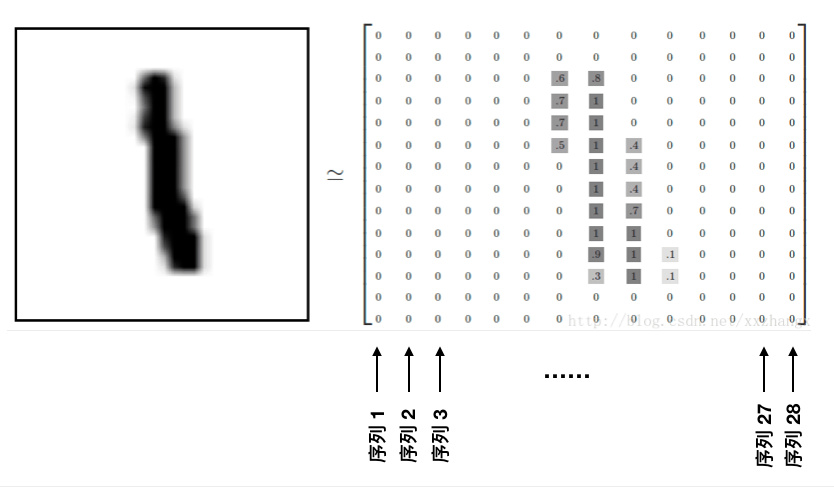

# Pytorch Note38 RNN 做图像分类

[toc]
全部笔记的汇总贴：[Pytorch Note 快乐星球](https://blog.csdn.net/weixin_45508265/article/details/117809512)

## 图片分类

 RNN 特别适合做序列类型的数据，那么 RNN 能不能想 CNN 一样用来做图像分类呢？下面我们用 mnist 手写字体的例子来展示一下如何用 RNN 做图像分类，但是这种方法并不是主流，这里我们只是作为举例。

首先需要将图片数据转化为一个序列数据，MINST手写数字图片的大小是28x28，那么可以将每张图片看作是长为28的序列，序列中的每个元素的特征维度是28，这样就将图片变成了一个序列。同时考虑循环神经网络的记忆性，所以图片从左往右输入网络的时候，网络可以记忆住前面观察东西，然后与后面部分结合得到最后预测数字的输出结果，理论上是行得通的。

对于一张手写字体的图片，其大小是 28 * 28，我们可以将其看做是一个长为 28 的序列，每个序列的特征都是 28，也就是



这样我们解决了输入序列的问题，对于输出序列怎么办呢？其实非常简单，虽然我们的输出是一个序列，但是我们只需要保留其中一个作为输出结果就可以了，这样的话肯定保留最后一个结果是最好的，因为最后一个结果有前面所有序列的信息，就像下面这样


在数据集中可以先标准化，然后对其可视化


```python
# 定义模型
class rnn_classify(nn.Module):
    def __init__(self, in_feature=28, hidden_feature=100, num_class=10, num_layers=2):
        super(rnn_classify, self).__init__()
        self.rnn = nn.LSTM(in_feature, hidden_feature, num_layers, batch_first = True) # 使用两层 lstm 将batch放在前面
        self.classifier = nn.Linear(hidden_feature, num_class) # 将最后一个 rnn 的输出使用全连接得到最后的分类结果
        
    def forward(self, x):
        '''
        x 大小为 (batch, 1, 28, 28)，所以我们需要将其转换成 RNN 的输入形式，即 (28, batch, 28)
        '''
        x = x.squeeze() # 去掉 (batch, 1, 28, 28) 中的 1，变成 (batch, 28, 28)
        out, _ = self.rnn(x) # 使用默认的隐藏状态，得到的 out 是 (batch, 28, hidden_feature)
        out = out[:, -1, :] # 取序列中的最后一个，大小是 (batch, hidden_feature)
        out = self.classifier(out) # 得到分类结果
        return out
```


```python
# 开始训练
from utils import train
Acc,Loss,Lr = train(net, train_loader, test_loader, 10, optimzier, criterion, scheduler, verbose=True)
```

```python
Epoch [  1/ 10]  Train Loss:1.750572  Train Acc:37.02% Test Loss:0.697916  Test Acc:77.95%  Learning Rate:0.100000	Time 00:14
Epoch [  2/ 10]  Train Loss:0.361676  Train Acc:88.89% Test Loss:0.193300  Test Acc:94.48%  Learning Rate:0.100000	Time 00:13
Epoch [  3/ 10]  Train Loss:0.187760  Train Acc:94.27% Test Loss:0.176153  Test Acc:94.53%  Learning Rate:0.100000	Time 00:14
Epoch [  4/ 10]  Train Loss:0.138180  Train Acc:95.82% Test Loss:0.150296  Test Acc:95.45%  Learning Rate:0.100000	Time 00:13
Epoch [  5/ 10]  Train Loss:0.110974  Train Acc:96.59% Test Loss:0.119391  Test Acc:96.45%  Learning Rate:0.100000	Time 00:14
Epoch [  6/ 10]  Train Loss:0.093230  Train Acc:97.19% Test Loss:0.103071  Test Acc:96.94%  Learning Rate:0.100000	Time 00:15
Epoch [  7/ 10]  Train Loss:0.081078  Train Acc:97.50% Test Loss:0.093530  Test Acc:97.21%  Learning Rate:0.100000	Time 00:15
Epoch [  8/ 10]  Train Loss:0.070568  Train Acc:97.83% Test Loss:0.075076  Test Acc:97.76%  Learning Rate:0.100000	Time 00:14
Epoch [  9/ 10]  Train Loss:0.062708  Train Acc:98.06% Test Loss:0.069279  Test Acc:98.03%  Learning Rate:0.100000	Time 00:14
Epoch [ 10/ 10]  Train Loss:0.056354  Train Acc:98.29% Test Loss:0.065537  Test Acc:98.15%  Learning Rate:0.100000	Time 00:14
```

可以看到，训练 10 次在简单的 mnist 数据集上也取得的了 98% 的准确率，应该是比较高了。虽然在一个简单的图片数据集上能够达到相对满意的效果，但是循环神经网络还是不适合处理图片类型的数据:

- 第一个原因是图片并没有很强的序列关系，图片中的信息可以从左往右看，也可以从右往左看，甚至可以跳着随机看，不管是什么样的方式都能够完整地理解图片信息;

- 第二个原因是循环神经网络传递的时候，必须前面一个数据计算结束才能进行后面一个数据的计算，这对于大图片而言是很慢的，但是卷积神经网络并不需要这样，因为它能够并行，在每一层卷积中，并不需要等待第一个卷积做完才能做第二个卷积，整体是可以同时进行的。