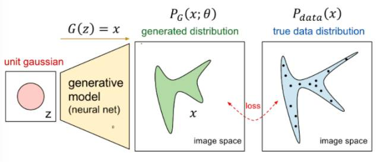

# Pytorch Note46 生成对抗网络的数学原理

[toc]

全部笔记的汇总贴：[Pytorch Note 快乐星球](https://blog.csdn.net/weixin_45508265/article/details/117809512)

之前介绍了什么是生成对抗，接下来会用严格的数学语言证明生成对抗网络的合理性。

详细也可以查看GAN的论文[Generative Adversarial Networks](https://arxiv.org/abs/1406.2661)

首先介绍一下`KL divergence`，这是统计学的一个概念，用来衡量两种概率分布的相似程度，数值越小，表示两种概率分布越接近。

分别有离散的概率分布和连续的概率分布，定义如下。

- 离散的概率分布
  $$
  D_{KL}(P||Q)=\sum_{i}P(i)\log\frac{P(i)}{Q(i)}
  $$
  
- 连续的概率分布
  $$
  D_{KL}(P||Q)=\int_{-\infty}^{+\infty}P(x)\log\frac{p(x)}{q(x)}d(x)
  $$
  

其实本质我们是想将一个随机的高斯噪声$z$通过一个生成网络$G$得到一个和真的数据分布$p_{data}(x)$差不多的生成分布$p_{G}(x;\theta)$，其中参数$\theta$是网络的参数决定的，希望找到$\theta$使得$p_{G}(x;\theta)$和$$p_{data}(x)$$尽可能接近。

可以用下面这张图说明

从论文来看，接着我们会从真实数据分布$P_{data}(x)$里面取样$m$个点，$\{x^1,x^2,\dots,x^m\}$，根据给定的参数 $\theta$ 可以计算概率$P_G(x^i;\theta)$，那么生成 $m$ 个样本数据的似然 （likehood）就是
$$
L=\prod_{i=1}^{m} P_{G}\left(x^{i} ; \theta\right)
$$
接着我们需要找到 $\theta^{*}$ 来最大化这个似然估计:
$$
\begin{aligned}
\theta^{*}&=\arg \max _{b} \prod_{i=1}^{m} p_{G}\left(x^{i} ; \theta\right) \Leftrightarrow \underset{\theta}{\arg \max } \log \prod_{i=1}^{m} P_{G}\left(x^{i} ; \theta\right)
\\
&=\underset{\theta}{\arg \max } \sum_{i}^{m} \log P_{G}\left(x^{i} ; \theta\right)
\\
&\approx \underset{\theta}{\arg \max } E_{x \sim P_{\text {theta }}}\left[\log P_{G}(x ; \theta)\right] \\
&\Leftrightarrow \underset{\theta}{\arg \max } \int_{x} P_{\text {dota }}(x) \log P_{G}(x ; \theta) d x-\int_{x} P_{\text {data }}(x) \log P_{\text {data }}(x) d x \\
&=\underset{\theta}{\arg \max } \int_{x} P_{\text {data }}(x) \log \frac{P_{G}(x ; \theta)}{P_{\text {data }}(x)} d x \\
&=\underset{\theta}{\arg \min } K L\left(P_{\text {data }}(x)|| P_{G}(x ; \theta)\right)
\end{aligned}
$$

接着我们的$P_G(x;\theta)$可以利用以下公式​
$$
P_{G}(x)=\int_{x} P_{p \text { rior }}(z) I_{[G(z)=x]} d z
$$
其中$I$表示示性函数，也就是：
$$
I_{G(a)=z}= \begin{cases}0 & G(z) \neq x \\ 1 & G(z)=x\end{cases}
$$
这就是生成模型的其本想法。

- Generator $\mathrm{G}$​ 足一个生成器, 给定先验分布 $P_{\text {prior }}(z)$​, 希望得到生成分布 $P_{G}(x)$​​, 这来很难通过极大似然估计得到结果。

- Dicriminator $D$​中 $D$​ 是一个函数，用来衡量$P_G(x)$​与$P_{data}(x)$​​之间的差距，可用来取代极大似然估计

首先定义函数 $V(G, D)$ 如下:
$$
V(G, D)=E_{x \sim P_{\text {data }}}[\log D(X)]+E_{x \sim P_{G}}[\log (1-D(X))]
$$
可以通过下面的式子求得最优的生成模型：
$$
G^{*}=\arg \min _{G} \max _{D} V(G, D)
$$
接下来我们如何通过求min和max得到最优的生成模型

首先我们只考虑 $\max _{D} V(G, D)$​, 看它表示什么含义。

在给定 $G$​ 的前提下，取一个合适的 $D$​ 使得 $V(G, D)$​​ 能够取得最大值, 这就是简单的微积分。
$$
\begin{aligned}
V &=E_{x \sim P_{\text {data }}}[\log D(X)]+E_{x \sim P_{G}}[\log (1-D(x))] \\
&=\int_{x} P_{\text {data }}(x) \log D(x) d x+\int_{x} p_{G}(x) \log (1-D(x)) d x \\
&\left.=\int_{x}\left[P_{\text {data }}(x) \log D(X)\right]+P_{G}(x) \log (1-D(x))\right] d x
\end{aligned}
$$
对于这个积分, 要取它的最大值, 希望对于给定的 $x$, 积分里面的项是最大的, 也就是 希望取到一个最优的 $D^{*}$ 最大化下面这个式子：
$$
P_{\text {data }}(x) \log D(x)+P_{G}(x) \log (1-D(x))
$$
在数据给定、 $G$​ 给定的前提下， $P_{\text {data }}(x)$​ 与 $P_{G}(x)$​ 都可以看作常数, 分别用 $\mathrm{a}, \mathrm{b}$​ 来表示它们，这样就可用得到如下的式子:

$$
\begin{aligned}
&f(D)=a \log (D)+b \log (1-D) \\
&\frac{d f(D)}{d D}=a \times \frac{1}{D}+b \times \frac{1}{1-D} \times(-1)=0 \\
&a \times \frac{1}{D^{*}}=b \times \frac{1}{1-D^{*}} \\
&\Leftrightarrow a \times\left(1-D^{*}\right)=b \times D^{*} \\
&D^{*}(x)=\frac{P_{\text {data }}(x)}{P_{\text {data }}(x)+P_{G}(x)}
\end{aligned}
$$
这样就求得了在给定 $G$ 的前提下, 能够使得 $V(D)$ 取得最大值的 $D$, 将 $D$ 代回原来的 $V(G, D)$, 得到如下的结果:
$$
\begin{aligned}
&\max V(G, D)=V\left(G, D^{*}\right) \\
&=E_{x \sim P_{\text {data }}}\left[\log \frac{P_{\text {data }}(x)}{P_{\text {data }}(x)+P_{G}(x)}\right]+E_{x \sim P_{G}}\left[\log \frac{P_{G}(x)}{P_{\text {data }}(x)+P_{G}(x)}\right] \\
&=\int_{x} P_{\text {data }}(x) \log \frac{\frac{1}{2} P_{\text {data }}}{\frac{P_{\text {data }}(x)+P_{G}(x)}{2}} d x+\int_{x} P_{G}(x) \log \frac{\frac{1}{2} P_{G}(x)}{\frac{P_{\text {data }}(x)+P_{G}(x)}{2}} d x \\
&=-2 \log 2+K L\left(P_{\text {data }}(x) \mid \frac{P_{\text {data }}(x)+P_{G}(x)}{2}\right)+K L\left(P_{G}(x) \| \frac{P_{\text {data }}(x)+P_{G}(x)}{2}\right) \\
&\text { (6. } \\
&=-2 \log 2+2 J S D\left(P_{\text {data }}(x) \| P_{G}(x)\right)
\end{aligned}
$$
这里引人了一个新的概念, JS Divergence, 定义如下:
$$
J S D(P \| Q)=\frac{1}{2} D(P|| M)+\frac{1}{2} D(Q|| M) \quad M=\frac{1}{2}(P+Q)
$$
通过上面的定义知道KL Divergence其实是不对称的，而JS Divergence是对称的，它们都能够用于衡量两种分布之间的差异。看到这里其实就已经推导出了为什么这么衡量是有意义的，因为取$D$​使得 $V(G,D)$​取得max值，这个时候这个max值是由两个KL divergence构成的，相当于这个max的值就是衡量$P_G(x)$​与$P_{data}(x)$​的差异程度，所以这个时候取:
$$
\arg \min _{G} \max _{D} V(G, D)
$$
就能取到$G$使得这两种分布的差异性最小，这样自然就能生成一个和原分布尽可能接近的分布，同时也摆脱了计算极大似然估计，所以其实GAN的本质是通过改变训练的过程来避免繁琐的计算。

