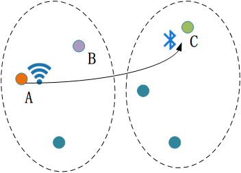
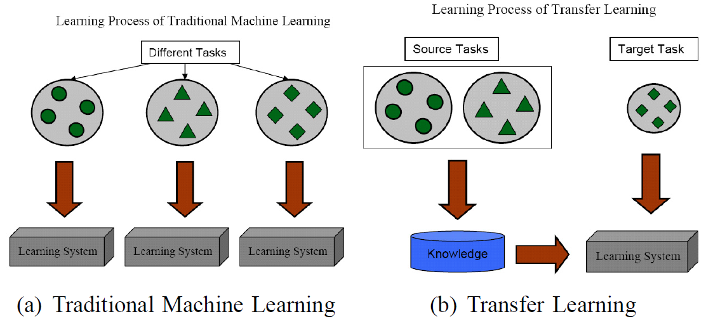

# Pytorch Note54 迁移学习简介

[toc]

## 迁移学习简介

迁移学习(transfer learning)通俗来讲，就是运用已有的知识来学习新的知识，核心是找到已有知识和新知识之间的相似性，用成语来说就是举一反三。由于直接对目标域从头开始学习成本太高，我们故而转向运用已有的相关知识来辅助尽快地学习新知识。比如，已经会下中国象棋，就可以类比着来学习国际象棋；已经会编写Java程序，就可以类比着来学习C#；已经学会英语，就可以类比着来学习法语；等等。世间万事万物皆有共性，如何合理地找寻它们之间的相似性，进而利用这个桥梁来帮助学习新知识，是迁移学习的核心问题。

 

比如图中不同位置、不同传感器的迁移标定。已知一个房间中A点的WiFi信号与相应的人体行为，如何标定另一个房间中C点的蓝牙信号？

具体地，在迁移学习中，我们已有的知识叫做源域(source domain)，要学习的新知识叫目标域(target domain)。迁移学习研究如何把源域的知识迁移到目标域上。特别地，在机器学习领域中，迁移学习研究如何将已有模型应用到新的不同的、但是有一定关联的领域中。传统机器学习在应对数据的分布、维度，以及模型的输出变化等任务时，模型不够灵活、结果不够好，而迁移学习放松了这些假设。在数据分布、特征维度以及模型输出变化条件下，有机地利用源域中的知识来对目标域更好地建模。另外，在有标定数据缺乏的情况下，迁移学习可以很好地利用相关领域有标定的数据完成数据的标定。

 

图2 迁移学习与传统机器学习的不同。(a)传统机器学习对不同的学习任务建立不同的模型，(b)迁移学习利用源域中的数据将知识迁移到目标域，完成模型建立。插图来自：Sinno Jialin Pan and Qiang Yang, A survey on transfer learning. IEEE TKDE 2010.

迁移学习按照学习方式可以分为基于样本的迁移，基于特征的迁移，基于模型的迁移，以及基于关系的迁移。基于样本的迁移通过对源域中有标定样本的加权利用完成知识迁移；基于特征的迁移通过将源域和目标域映射到相同的空间（或者将其中之一映射到另一个的空间中）并最小化源域和目标域的距离来完成知识迁移；基于模型的迁移将源域和目标域的模型与样本结合起来调整模型的参数；基于关系的迁移则通过在源域中学习概念之间的关系，然后将其类比到目标域中，完成知识的迁移。

理论上，任何领域之间都可以做迁移学习。但是，如果源域和目标域之间相似度不够，迁移结果并不会理想，出现所谓的负迁移情况。比如，一个人会骑自行车，就可以类比学电动车；但是如果类比着学开汽车，那就有点天方夜谭了。如何找到相似度尽可能高的源域和目标域，是整个迁移过程最重要的前提。

## 机器学习中的迁移学习

在机器学习的经典监督学习场景中，如果要针对一些任务A训练一个模型，会通过提供任务A的数据和标签来训练,现在已经在给定的数据集上训练了一个模型A，并且期望它在同一个任务和未知数据上表现良好。在另外一种情况下，当给定一些任务B的数据和标签时，也可以根据任务B来训练我们的模型B，这些都是很合理的，如图所示。

但是对于一个特定的任务、如果没有来自于该任务足够的数据集，传统的监督学习就无法支持了。迁移学习允许通过借用已经存在的一些相关任务的标签数据来处理这些场景，把解决相关任务时获得的知识存储下米，并将它应用在我们感兴趣的目标任务中。

正是由于这个原因，我们便可以使用ImageNet中预训练好的网络进行迁移学习了，因为网络通过完成ImageNet比赛，能够获得知识，也就是网络中的参数。比如我们希望做猫狗大战，ImangeNet中也有很多猫和狗的图片，所以我们认为网络在ImageNet中获得的知识能够进行迁移。

卷积神经网络可以理解为两个部分:前面的卷积部分和后面的分类部分，而前面的卷积部分主要做的事就是提取图片特征，而预训练好的网络对于图片的特征提取效果是非常好的，这是因为网络学到了需要的参数，我们可以直接用预训练的网络卷积部分来提取我们自己图片的特征，而对于我们自己的任务，也就是猫狗二分类，就用我们自己的分类全连接层就可以了。

以上就是迁移学习在图像识别中的一种应用，是不是特别简单呢?总结起来就是将预训练的网络迁移过来，然后训练过程中只更新最后的全连接层部分的参数，实现最后我们自己任务的分类日的。

最后强调一下，迁移学习并不是任何时候都能够使用的，前面我们提过，需要它们完成的任务是相关的，所以迁移学习在相似数据集上的应用效果才是良好的，比如你用的预训练的参数是自然景物的图片分类得到的，那么使用这些参数来做人脸的识别，效果可能就没有那么好了，因为人脸的特征提取和自然景物的特征提取是不同的，所以相应的参数训练后也是不同的。

[参考资料]

[1] Pan S J, Yang Q. A survey on transfer learning[J]. IEEE Transactions on knowledge and data engineering, 2010, 22(10): 1345-1359.

[2] Introduction to Transfer Learning: [http://jd92.wang/assets/files/l03_transferlearning.pdf](http://jd92.wang/assets/files/l03_transferlearning.pdf)。

[3] Qiang Yang: [http://www.cse.ust.hk/~qyang/](http://www.cse.ust.hk/~qyang/).

[4] Sinno Jialin Pan: [http://www.ntu.edu.sg/home/sinnopan/](http://www.ntu.edu.sg/home/sinnopan/).

[5] Wenyuan Dai: [https://scholar.google.com/citations?user=AGR9pP0AAAAJ&hl=zh-CN](https://scholar.google.com/citations?user=AGR9pP0AAAAJ&hl=zh-CN).

[6] SEBASTIAN RUDER:[https://ruder.io/transfer-learning/](https://ruder.io/transfer-learning/)

