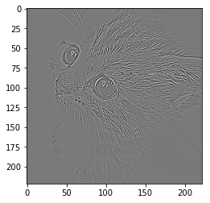
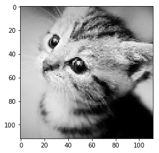

# Pytorch Note28 Pytorch的卷积模块

[toc]

全部笔记的汇总贴：[Pytorch Note 快乐星球](https://blog.csdn.net/weixin_45508265/article/details/117809512)

卷积网络在计算机视觉领域被应用得非常广泛，那么常见的卷机网络中用到的模块能够使用 pytorch 非常轻松地实现，下面我们来讲一下 pytorch 中的卷积模块

## 卷积层

卷积在 pytorch 中有两种方式，一种是 `torch.nn.Conv2d()`，一种是 `torch.nn.functional.conv2d()`，这两种形式本质都是使用一个卷积操作

nn.Conv2d(in_channels, out_channels, kernel_size, stride=1,padding=0, dilation=1, groups=1, bias=True)就是PyTorch中的卷积模块了，里面常用的参数有5个，分别是 in_channels，out_channels，kernel_size，stride，padding，除此之外还有参数dilation,groups,bias。下面来具体解释每个参数的含义

- in_channels：对应的是输入数据体的深度；
- out_channels：对应的是输出数据体的深度；
- kernel_size：表示滤波器的大小，可以使用一个数字来表示高和宽相同的卷积核，比如kernel_size=3，也可以使用不同的数字来表示高和宽不同的卷积核，比如kernel_size=(3, 2)；
- stride：表示滑动的步长；
- padding=0：表示四周不进行零填充，padding=1表示四周进行1个像素点的填充；
- bias：一个布尔值，默认bias=True，表示使用偏置；
- groups：表示输出数据体深度上和输入数据体深度上的联系，默认groups=1，也就是所有的输出和每一个输入都是相关联的，groups>1说明将输入和输出的深度分别分为 groups组各自进行卷积将得到的输出拼接（组卷积）;
- dilation：表示卷积对于输入数据体的空间间隔，默认dilation=1;（空洞卷积）

```python
im = Image.open('./cat.png').convert('L') # 读入一张灰度图的图片
im = np.array(im, dtype='float32') # 将其转换为一个矩阵
```

```python
# 可视化图片
plt.imshow(im.astype('uint8'), cmap='gray')
```


```python
# 将图片矩阵转化为 pytorch tensor，并适配卷积输入的要求
im = torch.from_numpy(im.reshape((1, 1, im.shape[0], im.shape[1]))) 
```

下面我们定义一个算子对其进行轮廓检测

```python
# 使用 nn.Conv2d
conv1 = nn.Conv2d(1, 1, 3, bias=False) # 定义卷积

sobel_kernel = np.array([[-1, -1, -1], [-1, 8, -1], [-1, -1, -1]], dtype='float32') # 定义轮廓检测算子
sobel_kernel = sobel_kernel.reshape((1, 1, 3, 3)) # 适配卷积的输入输出
conv1.weight.data = torch.from_numpy(sobel_kernel) # 给卷积的 kernel 赋值

edge1 = conv1(Variable(im)) # 作用在图片上
edge1 = edge1.data.squeeze().numpy() # 将输出转换为图片的格式
```

下面我们可视化边缘检测之后的结果

```python
plt.imshow(edge1, cmap='gray')
```



## 池化层

卷积网络中另外一个非常重要的结构就是池化，这是利用了图片的下采样不变性，即一张图片变小了还是能够看出了这张图片的内容，而使用池化层能够将图片大小降低，非常好地提高了计算效率，同时池化层也没有参数。池化的方式有很多种，比如最大值池化，均值池化等等，在卷积网络中一般使用最大值池化。

在 pytorch 中最大值池化的方式也有两种，一种是 `nn.MaxPool2d()`，一种是 `torch.nn.functional.max_pool2d()`，他们对于图片的输入要求跟卷积对于图片的输入要求是一样的

其中的参数有kernel_size、stride、padding、dilation、return_indices、ceil_mode，下面来具体解释一下它们各自的含义：

- kernel_size、stride、padding、dilation之前的卷积层已经介绍过了，是相同的含义；

- return_indices：表示是否返回最大值所处的下标，默认return_indices=False；

- ceil_mode：表示使用一些方格代替层结构，默认ceil_mode=False，一般都不会设置这些参数；

- nn.AvgPool2d：表示均值池化，里面的参数和 nn.MaxPool2d类似，但多一个参数count_include_pad，这个参数表示计算均值的时

  是否包括零填充，默认count_include_pad=True；
  

```python
# 使用 nn.MaxPool2d
pool1 = nn.MaxPool2d(2, 2)
print('before max pool, image shape: {} x {}'.format(im.shape[2], im.shape[3]))
small_im1 = pool1(Variable(im))
small_im1 = small_im1.data.squeeze().numpy()
print('after max pool, image shape: {} x {} '.format(small_im1.shape[0], small_im1.shape[1]))
```

```python
before max pool, image shape: 224 x 224
after max pool, image shape: 112 x 112 
```

可以看到图片的大小减小了一半，那么图片是不是变了呢？我们可以可视化一下

```python
plt.imshow(small_im1, cmap='gray')
```


