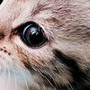
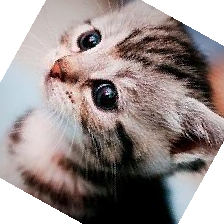
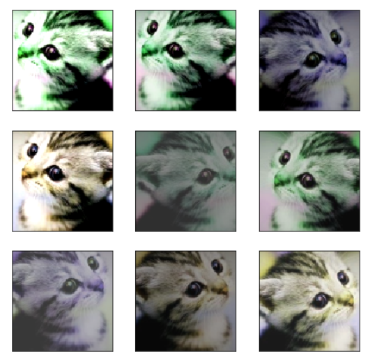

# Pytorch Note33 数据增强

[toc]

全部笔记的汇总贴：[Pytorch Note 快乐星球](https://blog.csdn.net/weixin_45508265/article/details/117809512)

前面我们已经讲了几个非常著名的卷积网络的结构，但是单单只靠这些网络并不能取得 state-of-the-art 的结果，现实问题往往更加复杂，非常容易出现过拟合的问题，而数据增强的方法是对抗过拟合问题的一个重要方法，可以提高模型的准确率和泛化能力。

2012 年 AlexNet 在 ImageNet 上大获全胜，图片增强方法功不可没，因为有了图片增强，使得训练的数据集比实际数据集多了很多'新'样本，减少了过拟合的问题，下面我们来具体解释一下。

## 常用的数据增强方法
常用的数据增强方法如下： 

1. 对图片进行一定比例缩放 
2. 对图片进行随机位置的截取 
3. 对图片进行随机的水平和竖直翻转
4. 对图片进行随机角度的旋转
5. 对图片进行亮度、对比度和颜色的随机变化

这些方法 pytorch 都已经为我们内置在了 torchvision 里面，我们在安装 pytorch 的时候也安装了 torchvision，下面我们来依次展示一下这些数据增强方法

```python
from PIL import Image
from torchvision import transforms as tfs
```

```python
# 读入一张图片
im = Image.open('./cat.png')
im
```


### 随机比例放缩

随机比例缩放主要使用的是 `torchvision.transforms.Resize()` 这个函数，第一个参数可以是一个整数，那么图片会保存现在的宽和高的比例，并将更短的边缩放到这个整数的大小，第一个参数也可以是一个 tuple，那么图片会直接把宽和高缩放到这个大小；第二个参数表示放缩图片使用的方法，比如最邻近法，或者双线性差值等，一般双线性差值能够保留图片更多的信息，所以 pytorch 默认使用的是双线性差值，你可以手动去改这个参数，更多的信息可以看看[文档](http://pytorch.org/docs/0.3.0/torchvision/transforms.html)

```python
# 比例缩放
print('before scale, shape: {}'.format(im.size))
new_im = tfs.Resize((100, 200))(im)
print('after scale, shape: {}'.format(new_im.size))
new_im
```

```python
before scale, shape: (224, 224)
after scale, shape: (200, 100)
```


其实还有一个Scale，也可以对图片的尺度进行放大和缩小，但是慢慢的，这种用的比较少，用法与Resize是相似的

### 随机位置截取
随机位置截取能够提取出图片中局部的信息，使得网络接受的输入具有多尺度的特征，所以能够有较好的效果。在 torchvision 中主要有下面两种方式，一个是 `torchvision.transforms.RandomCrop()`，传入的参数就是截取出的图片的长和宽，对图片在随机位置进行截取；第二个是 `torchvision.transforms.CenterCrop()`，同样传入介曲初的图片的大小作为参数，会在图片的中心进行截取

```python
# 随机裁剪出 100 x 100 的区域
random_im1 = tfs.RandomCrop(100)(im)
random_im1
```


```python
# 随机裁剪出 150 x 100 的区域
random_im2 = tfs.RandomCrop((150, 100))(im)
random_im2
```


```python
# 中心裁剪出 100 x 100 的区域
center_im = tfs.CenterCrop(100)(im)
center_im
```



### 随机的水平和竖直方向翻转
对于上面这一张猫的图片，如果我们将它翻转一下，它仍然是一张猫，但是图片就有了更多的多样性，所以随机翻转也是一种非常有效的手段。在 torchvision 中，随机翻转使用的是 `torchvision.transforms.RandomHorizontalFlip()` 和 `torchvision.transforms.RandomVerticalFlip()`

```python
# 随机水平翻转
h_filp = tfs.RandomHorizontalFlip()(im)
h_filp
```


```python
# 随机竖直翻转
v_flip = tfs.RandomVerticalFlip()(im)
v_flip
```


### 随机角度旋转
一些角度的旋转仍然是非常有用的数据增强方式，在 torchvision 中，使用 `torchvision.transforms.RandomRotation()` 来实现，其中第一个参数就是随机旋转的角度，比如填入 10，那么每次图片就会在 -10 ~ 10 度之间随机旋转

```python
rot_im = tfs.RandomRotation(45)(im)
rot_im
```



### 亮度、对比度和颜色的变化
除了形状变化外，颜色变化又是另外一种增强方式，其中可以设置亮度变化，对比度变化和颜色变化等，在 torchvision 中主要使用 `torchvision.transforms.ColorJitter()` 来实现的，第一个参数就是亮度的比例，第二个是对比度，第三个是饱和度，第四个是颜色

```python
# 亮度
bright_im = tfs.ColorJitter(brightness=1)(im) # 随机从 0 ~ 2 之间亮度变化，1 表示原图
bright_im
```

```python
# 对比度
contrast_im = tfs.ColorJitter(contrast=1)(im) # 随机从 0 ~ 2 之间对比度变化，1 表示原图
contrast_im
```

```python
# 颜色
color_im = tfs.ColorJitter(hue=0.5)(im) # 随机从 -0.5 ~ 0.5 之间对颜色变化
color_im
```

上面我们讲了这么图片增强的方法，其实这些方法都不是孤立起来用的，可以联合起来用，比如先做随机翻转，然后随机截取，再做对比度增强等等，torchvision 里面有个非常方便的函数能够将这些变化合起来，就是 `torchvision.transforms.Compose()`，下面我们举个例子

```python
im_aug = tfs.Compose([
    tfs.Resize(120),
    tfs.RandomHorizontalFlip(),
    tfs.RandomCrop(96),
    tfs.ColorJitter(brightness=0.5, contrast=0.5, hue=0.5)
])
```

```python
nrows = 3
ncols = 3
figsize = (8, 8)
_, figs = plt.subplots(nrows, ncols, figsize=figsize)
for i in range(nrows):
    for j in range(ncols):
        figs[i][j].imshow(im_aug(im))
        figs[i][j].axes.get_xaxis().set_visible(False)
        figs[i][j].axes.get_yaxis().set_visible(False)
plt.show()
```



可以看到每次做完增强之后的图片都有一些变化，所以这就是我们前面讲的，增加了一些'新'数据


## 总结

在我们模型训练中，如果加了数据增强，可能对于我们的训练集的数据的训练会更难了，但是对于我们测试集来说，准确率会比不使用更高，因为数据增强提高了模型应对于更多的不同数据集的泛化能力，所以有更好的效果。

所以数据增强是一个很好的提高泛化能力的方法，对多任务进行数据增强之后都能够在一定程度上提升任务的准确率。
