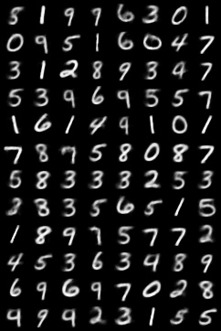
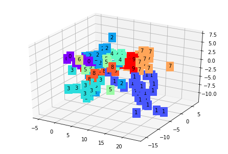
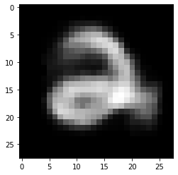
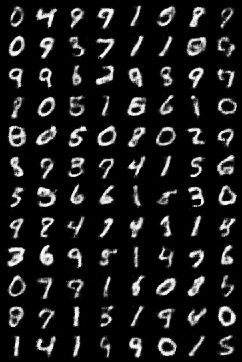

# Pytorch Note43 自动编码器(Autoencoder)

[toc]

全部笔记的汇总贴：[Pytorch Note 快乐星球](https://blog.csdn.net/weixin_45508265/article/details/117809512)

## 自动编码器

自动编码器最开始是作为一种数据压缩方法，同时还可以在卷积网络中进行逐层预训练，但是随后更多结构复杂的网络，比如 resnet 的出现使得我们能够训练任意深度的网络，自动编码器就不再使用在这个方面，下面我们讲一讲自动编码器的一个新的应用，这是随着生成对抗模型而出现的，就是使用自动编码器生成数据。

其特点有:
(1）跟数据相关程度很高，这意味着自动编码器只能压缩与训练数据相似的数据.因为使用神经网络提取的特征一般是高度相关于原始的训练集，使用人脸训练出来的自动编码器在压缩自然界动物的图片时表现就会比较差，因为它只学习到了人脸的特征,而没有学习到自然界图片的特征。
(2）压缩后数据是有损的，这是因为在降维的过程中不可避免地要丢失信息。到了2012年,人们发现在卷积神经网络中使用自动编码器做逐层预训练可以训练更深层的网络，但是人们很快发现，良好的初始化策略要比复杂的逐层预训练有效得多，2014年出现的 Batch Normalization技术也使得更深的网络能够被有效训练，到了2015年年底，通过残差（ResNet)基本可以训练任意深度的神经网络。
所以现在自动编码器主要应用在两个方面:第一是数据去噪，第二是进行可视化降维。自动编码器还有一个功能,即生成数据。

自动编码器的一般结构如下


由上面的图片，我们能够看到，第一部分是编码器(encoder)，第二部分是解码器(decoder)，编码器和解码器都可以是任意的模型，通常我们可以使用神经网络作为我们的编码器和解码器，输入的数据经过神经网络降维到一个编码，然后又通过另外一个神经网络解码得到一个与原始数据一模一样的生成数据，通过比较原始数据和生成数据，希望他们尽可能接近，所以最小化他们之间的差异来训练网络中编码器和解码器的参数。

当训练完成之后，我们如何生成数据呢？非常简单，我们只需要拿出解码器的部分，然后随机传入 code，就可以通过解码器生成各种各样的数据


下面我们使用 mnist 数据集来说明一个如何构建一个简单的自动编码器

## 数据预处理

首先进行数据预处理和迭代器的构建

```python
im_tfs = tfs.Compose([
    tfs.ToTensor(),
    tfs.Normalize([0.5, 0.5, 0.5], [0.5, 0.5, 0.5]) # 标准化
])

train_set = MNIST('./mnist', transform=im_tfs, download = True)
train_data = DataLoader(train_set, batch_size=128, shuffle=True)
```

## 定义网络

```python
# 定义网络
class autoencoder(nn.Module):
    def __init__(self):
        super(autoencoder, self).__init__()
        
        self.encoder = nn.Sequential(
            nn.Linear(28*28, 128),
            nn.ReLU(True),
            nn.Linear(128, 64),
            nn.ReLU(True),
            nn.Linear(64, 12),
            nn.ReLU(True),
            nn.Linear(12, 3) # 输出的 code 是 3 维，便于可视化
        )
        
        self.decoder = nn.Sequential(
            nn.Linear(3, 12),
            nn.ReLU(True),
            nn.Linear(12, 64),
            nn.ReLU(True),
            nn.Linear(64, 128),
            nn.ReLU(True),
            nn.Linear(128, 28*28),
            nn.Tanh()
        )

    def forward(self, x):
        encode = self.encoder(x)
        decode = self.decoder(encode)
        return encode, decode
```

这里定义的编码器和解码器都是 4 层神经网络作为模型，中间使用 relu 激活函数，最后输出的 code 是三维，注意解码器最后我们使用 tanh 作为激活函数，因为输入图片标准化在 -1 ~ 1 之间，所以输出也要在 -1 ~ 1 这个范围内，最后我们可以验证一下

```python
net = autoencoder()
x = torch.randn(1, 28*28) # batch size 是 1
code, _ = net(x)
print(code.shape)
```

> ```python
> torch.Size([1, 3])
> ```

可以看到最后得到的 code 就是三维的

```python
criterion = nn.MSELoss(size_average=False)
optimizer = torch.optim.Adam(net.parameters(), lr=1e-3)

def to_img(x):
    '''
    定义一个函数将最后的结果转换回图片
    '''
    x = 0.5 * (x + 1.)
    x = x.clamp(0, 1)
    x = x.view(x.shape[0], 1, 28, 28)
    return x
```

## 开始训练

```python
# 开始训练自动编码器
for e in range(100):
    for im, _ in train_data:
        im = im.view(im.shape[0], -1)
        im = Variable(im)
        # 前向传播
        _, output = net(im)
        loss = criterion(output, im) / im.shape[0] # 平均
        # 反向传播
        optimizer.zero_grad()
        loss.backward()
        optimizer.step()
    
    if (e+1) % 20 == 0: # 每 20 次，将生成的图片保存一下
        print('epoch: {}, Loss: {:.4f}'.format(e + 1, loss.data[0]))
        pic = to_img(output.cpu().data)
        if not os.path.exists('./simple_autoencoder'):
            os.mkdir('./simple_autoencoder')
        save_image(pic, './simple_autoencoder/image_{}.png'.format(e + 1))
```

训练完成之后我们可以看看生成的图片效果



可以看出，图片还是具有较好的清晰度

## 可视化

我们可以将编码的分布可视化出来，具体看看随机给一个三维的编码，能够生成图片的分布

```python
import matplotlib.pyplot as plt
from matplotlib import cm
from mpl_toolkits.mplot3d import Axes3D
%matplotlib inline

# 可视化结果
view_data = (train_set.train_data[:200].type(torch.FloatTensor).view(-1, 28*28) / 255. - 0.5) / 0.5
view_data = view_data.to(device)
encode, _ = net(view_data)    # 提取压缩的特征值
fig = plt.figure(2)
ax = Axes3D(fig)    # 3D 图
# x, y, z 的数据值
X = encode.data[:, 0].cpu().numpy()
Y = encode.data[:, 1].cpu().numpy()
Z = encode.data[:, 2].cpu().numpy()
values = train_set.train_labels[:200].numpy()  # 标签值
for x, y, z, s in zip(X, Y, Z, values):
    c = cm.rainbow(int(255*s/9))    # 上色
    ax.text(x, y, z, s, backgroundcolor=c)  # 标位子
ax.set_xlim(X.min(), X.max())
ax.set_ylim(Y.min(), Y.max())
ax.set_zlim(Z.min(), Z.max())
plt.show()
```



可以看到，不同种类的图片进入自动编码器之后会被编码得不同，而相同类型的图片经过自动编码之后的编码在几何示意图上距离较近，在训练好自动编码器之后，我们可以给一个随机的 code，通过 decoder 生成图片

```python
code = torch.FloatTensor([[1.19, -3.36, 2.06]]) # 给一个 code 是 (1.19, -3.36, 2.06)
decode = net.decoder(code.to(device))
decode_img = to_img(decode).squeeze()
decode_img = decode_img.data.cpu().numpy() * 255
plt.imshow(decode_img.astype('uint8'), cmap='gray') # 生成图片 3
```




这里我们仅仅使用多层神经网络定义了一个自动编码器，当然你会想到，为什么不使用效果更好的卷积神经网络呢？我们当然可以使用卷积神经网络来定义，下面我们就重新定义一个卷积神经网络来进行 autoencoder

## 卷积神经网络 Autoencoder

```python
class conv_autoencoder(nn.Module):
    def __init__(self):
        super(conv_autoencoder, self).__init__()
        
        self.encoder = nn.Sequential(
            nn.Conv2d(1, 16, 3, stride=3, padding=1),  # (b, 16, 10, 10)
            nn.ReLU(True),
            nn.MaxPool2d(2, stride=2),  # (b, 16, 5, 5)
            nn.Conv2d(16, 8, 3, stride=2, padding=1),  # (b, 8, 3, 3)
            nn.ReLU(True),
            nn.MaxPool2d(2, stride=1)  # (b, 8, 2, 2)
        )
        
        self.decoder = nn.Sequential(
            nn.ConvTranspose2d(8, 16, 3, stride=2),  # (b, 16, 5, 5)
            nn.ReLU(True),
            nn.ConvTranspose2d(16, 8, 5, stride=3, padding=1),  # (b, 8, 15, 15)
            nn.ReLU(True),
            nn.ConvTranspose2d(8, 1, 2, stride=2, padding=1),  # (b, 1, 28, 28)
            nn.Tanh()
        )

    def forward(self, x):
        encode = self.encoder(x)
        decode = self.decoder(encode)
        return encode, decode
```

```python
conv_net = conv_autoencoder()
if torch.cuda.is_available():
    conv_net = conv_net.cuda()
optimizer = torch.optim.Adam(conv_net.parameters(), lr=1e-3, weight_decay=1e-5)
```

对于卷积网络中，我们可以对输入进行上采样，那么对于卷积神经网络，我们可以使用转置卷积进行这个操作，在 pytorch 中使用转置卷积就是上面的操作，`torch.nn.ConvTranspose2d()` 就可以了，可以在某种意义上看成是反卷积。

```python
# 开始训练自动编码器
for e in range(40):
    for im, _ in train_data:
        if torch.cuda.is_available():
            im = im.cuda()
        # 前向传播
        _, output = conv_net(im)
        loss = criterion(output, im) / im.shape[0] # 平均
        # 反向传播
        optimizer.zero_grad()
        loss.backward()
        optimizer.step()
    
    if (e+1) % 20 == 0: # 每 20 次，将生成的图片保存一下
        print('epoch: {}, Loss: {:.4f}'.format(e+1, loss.data))
        pic = to_img(output.cpu().data)
        if not os.path.exists('./conv_autoencoder'):
            os.mkdir('./conv_autoencoder')
        save_image(pic, './conv_autoencoder/image_{}.png'.format(e+1))
```

> ```python
> epoch: 20, Loss: 70.8879
> epoch: 40, Loss: 74.8522
> ```

最后我们看看结果



跟前面的相比，两者的区别其实并不大，只不过多层感知机的结果会稍微模糊一些

