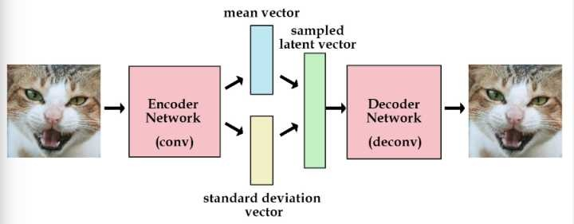

# Pytorch Note44 变分自动编码器（VAE）

[toc]

全部笔记的汇总贴：[Pytorch Note 快乐星球](https://blog.csdn.net/weixin_45508265/article/details/117809512)

## 变分自动编码器

变分编码器是自动编码器的升级版本，其结构跟自动编码器是类似的，也由编码器和解码器构成。

回忆一下，自动编码器有个问题，就是并不能任意生成图片，因为我们没有办法自己去构造隐藏向量，需要通过一张图片输入编码我们才知道得到的隐含向量是什么，这时我们就可以通过变分自动编码器来解决这个问题。

其实原理特别简单，只需要在编码过程给它增加一些限制，迫使其生成的隐含向量能够粗略的遵循一个标准正态分布，这就是其与一般的自动编码器最大的不同。

这样我们生成一张新图片就很简单了，我们只需要给它一个标准正态分布的随机隐含向量，这样通过解码器就能够生成我们想要的图片，而不需要给它一张原始图片先编码。

一般来讲，我们通过 encoder 得到的隐含向量并不是一个标准的正态分布，为了衡量两种分布的相似程度，我们使用 KL divergence，利用其来表示隐含向量与标准正态分布之间差异的 loss，另外一个 loss 仍然使用生成图片与原图片的均方误差来表示。

KL divergence 的公式如下

$$
D{KL} (P || Q) =  \int_{-\infty}^{\infty} p(x) \log \frac{p(x)}{q(x)} dx
$$

## 重参数
为了避免计算 KL divergence 中的积分，我们使用重参数的技巧，不是每次产生一个隐含向量，而是生成两个向量，一个表示均值，一个表示标准差，这里我们默认编码之后的隐含向量服从一个正态分布的之后，就可以用一个标准正态分布先乘上标准差再加上均值来合成这个正态分布，最后 loss 就是希望这个生成的正态分布能够符合一个标准正态分布，也就是希望均值为 0，方差为 1

所以标准的变分自动编码器如下



所以最后我们可以将我们的 loss 定义为下面的函数，由均方误差和 KL divergence 求和得到一个总的 loss

```python
def loss_function(recon_x, x, mu, logvar):
    """
    recon_x: generating images
    x: origin images
    mu: latent mean
    logvar: latent log variance
    """
    MSE = reconstruction_function(recon_x, x)
    # loss = 0.5 * sum(1 + log(sigma^2) - mu^2 - sigma^2)
    KLD_element = mu.pow(2).add_(logvar.exp()).mul_(-1).add_(1).add_(logvar)
    KLD = torch.sum(KLD_element).mul_(-0.5)
    # KL divergence
    return MSE + KLD
```

下面我们用 mnist 数据集来简单说明一下变分自动编码器

## 定义VAE

```python
class VAE(nn.Module):
    def __init__(self):
        super(VAE, self).__init__()

        self.fc1 = nn.Linear(784, 400)
        self.fc21 = nn.Linear(400, 20) # mean
        self.fc22 = nn.Linear(400, 20) # var
        self.fc3 = nn.Linear(20, 400)
        self.fc4 = nn.Linear(400, 784)

    def encode(self, x):
        h1 = F.relu(self.fc1(x))
        return self.fc21(h1), self.fc22(h1)

    def reparametrize(self, mu, logvar):
        std = logvar.mul(0.5).exp_()
        eps = torch.FloatTensor(std.size()).normal_()
        if torch.cuda.is_available():
            eps = eps.cuda()
        else:
            eps = eps
        return eps.mul(std).add_(mu)

    def decode(self, z):
        h3 = F.relu(self.fc3(z))
        return F.tanh(self.fc4(h3))

    def forward(self, x):
        mu, logvar = self.encode(x) # 编码
        z = self.reparametrize(mu, logvar) # 重新参数化成正态分布
        return self.decode(z), mu, logvar # 解码，同时输出均值方差
```

```python
net = VAE() # 实例化网络
if torch.cuda.is_available():
    net = net.cuda()
```

```python
x, _ = train_set[0]
x = x.view(x.shape[0], -1)
if torch.cuda.is_available():
    x = x.cuda()
_, mu, var = net(x)
print(mu)
```

> ```python
> tensor([[-1.7714e-01, -3.3226e-02,  1.8475e-04, -2.1119e-01, -3.0027e-01,
>          -9.8018e-02,  5.1128e-02, -7.5215e-02, -1.6336e-01,  6.2949e-02,
>           3.7830e-03,  2.7366e-01, -2.6736e-01, -1.7473e-01, -3.8985e-01,
>           5.1227e-02,  7.3497e-02,  1.4625e-01, -7.1520e-02,  3.5298e-01]],
>        device='cuda:0', grad_fn=<AddmmBackward>)
> ```

可以看到，对于输入，网络可以输出隐含变量的均值和方差，这里的均值方差还没有训练

下面开始训练

## 训练

```python
reconstruction_function = nn.MSELoss(size_average=False)

def loss_function(recon_x, x, mu, logvar):
    """
    recon_x: generating images
    x: origin images
    mu: latent mean
    logvar: latent log variance
    """
    MSE = reconstruction_function(recon_x, x)
    # loss = 0.5 * sum(1 + log(sigma^2) - mu^2 - sigma^2)
    KLD_element = mu.pow(2).add_(logvar.exp()).mul_(-1).add_(1).add_(logvar)
    KLD = torch.sum(KLD_element).mul_(-0.5)
    # KL divergence
    return MSE + KLD

optimizer = torch.optim.Adam(net.parameters(), lr=1e-3)

def to_img(x):
    '''
    定义一个函数将最后的结果转换回图片
    '''
    x = 0.5 * (x + 1.)
    x = x.clamp(0, 1)
    x = x.view(x.shape[0], 1, 28, 28)
    return x
```

```python
reconstruction_function = nn.MSELoss(size_average=False)

def loss_function(recon_x, x, mu, logvar):
    """
    recon_x: generating images
    x: origin images
    mu: latent mean
    logvar: latent log variance
    """
    MSE = reconstruction_function(recon_x, x)
    # loss = 0.5 * sum(1 + log(sigma^2) - mu^2 - sigma^2)
    KLD_element = mu.pow(2).add_(logvar.exp()).mul_(-1).add_(1).add_(logvar)
    KLD = torch.sum(KLD_element).mul_(-0.5)
    # KL divergence
    return MSE + KLD

optimizer = torch.optim.Adam(net.parameters(), lr=1e-3)

def to_img(x):
    '''
    定义一个函数将最后的结果转换回图片
    '''
    x = 0.5 * (x + 1.)
    x = x.clamp(0, 1)
    x = x.view(x.shape[0], 1, 28, 28)
    return x
```

```python
for e in range(100):
    for im, _ in train_data:
        im = im.view(im.shape[0], -1)
        if torch.cuda.is_available():
            im = im.cuda()
        recon_im, mu, logvar = net(im)
        loss = loss_function(recon_im, im, mu, logvar) / im.shape[0] # 将 loss 平均
        optimizer.zero_grad()
        loss.backward()
        optimizer.step()

    if (e + 1) % 20 == 0:
        print('epoch: {}, Loss: {:.4f}'.format(e + 1, loss.data))
        save = to_img(recon_im.cpu().data)
        if not os.path.exists('./vae_img'):
            os.mkdir('./vae_img')
        save_image(save, './vae_img/image_{}.png'.format(e + 1))
```

> ```python
> epoch: 20, Loss: 68.4358
> epoch: 40, Loss: 63.8153
> epoch: 60, Loss: 59.8225
> epoch: 80, Loss: 64.8400
> epoch: 100, Loss: 64.3905
> ```

可以看看使用变分自动编码器得到的结果，可以发现效果比一般的编码器要好很多


我们可以输出其中的均值看看

```python
x, _ = train_set[0]
x = x.view(x.shape[0], -1)
if torch.cuda.is_available():
    x = x.cuda()
_, mu, _ = net(x)
print(mu)
```

> ```python
> tensor([[ 0.3334,  0.0050,  0.0564,  1.2526, -0.8657,  0.1395, -0.2028, -1.6824,
>           0.6442,  0.9594, -0.6583, -0.4416, -0.3341,  3.4309, -0.0213, -2.1715,
>          -1.2688,  0.4125,  0.0148,  1.3052]], device='cuda:0',
>        grad_fn=<AddmmBackward>)
> ```

变分自动编码器虽然比一般的自动编码器效果要好，而且也限制了其输出的编码 (code) 的概率分布，但是它仍然是通过直接计算生成图片和原始图片的均方误差来生成 loss，这个方式并不好，在下面生成对抗网络中，我们会讲一讲这种方式计算 loss 的局限性，然后会介绍一种新的训练办法，就是通过生成对抗的训练方式来训练网络而不是直接比较两张图片的每个像素点的均方误差

